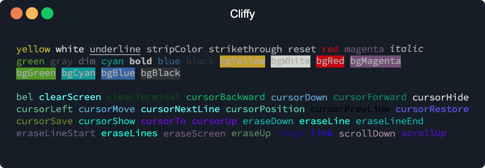

<h1 align="center">Cliffy ❯ Ansi</h1>

<p align="center" class="badges-container">
  <a href="https://github.com/c4spar/deno-cliffy/actions?query=workflow%3ATest">
    
  </a>
  <a href="https://github.com/c4spar/deno-cliffy/releases">
    
  </a>
  <a href="https://github.com/c4spar/deno-cliffy/labels/module%3Aansi-escape">
    
  </a>
  <a href="https://deno.land/">
    
  </a>
  <a href="https://doc.deno.land/https/deno.land/x/cliffy/ansi/mod.ts">
    
  </a>
  <a href="https://discord.gg/nktwtG">
    
  </a>
  <a href="https://github.com/c4spar/deno-cliffy/blob/master/LICENSE">
    
  </a>
  <a href="https://nest.land/package/cliffy">
    
  </a>
</p>

<p align="center">
  <b>Ansi escape sequences for Deno.</b><br>
  <sub>>_ Control cli cursor, erase output, scroll window and more.</sub>
</p>

<p align="center">
  
</p>

## ❯ Content

- [Install](#-install)
- [Usage](#-usage)
  - [Ansi](#ansi)
  - [Tty](#tty)
  - [Colors](#colors)
- [Contributing](#-contributing)
- [License](#-license)

## ❯ Install

This module can be imported directly from the repo and from following registries.

Deno Registry

```typescript
import { ansi, colors, tty, cursorTo } from "https://deno.land/x/cliffy@<version>/ansi/mod.ts";
```

Nest Registry

```typescript
import { ansi, colors, tty, cursorTo } from "https://x.nest.land/cliffy@<version>/ansi/mod.ts";
```

Github

```typescript
import { ansi, colors, tty, cursorTo } from "https://raw.githubusercontent.com/c4spar/deno-cliffy/<version>/ansi/mod.ts";
```

## ❯ Usage

### Ansi

The ansi module exports an `ansi` object with chainable methods and properties for generating ansi escape sequence
strings. The last property must be invoked as a method to generate the ansi string.

```typescript
import { ansi } from "https://deno.land/x/cliffy/ansi/ansi.ts";

console.log(
  ansi.cursorUp.cursorLeft.eraseDown()
);
```

If a method takes some arguments, you have to invoke the `.toString()` method to generate the ansi string.

```typescript
import { ansi } from "https://deno.land/x/cliffy/ansi/ansi.ts";

console.log(
  ansi.cursorUp(2).cursorLeft.eraseDown(2).toString()
);
```

Convert to `Uint8Array`:

```typescript
import { ansi } from "https://deno.land/x/cliffy/ansi/ansi.ts";

await Deno.stdout.write(
  ansi.cursorUp.cursorLeft.eraseDown.toBuffer()
);
```

You can also directly import the ansi escape methods from the `ansi_escapes.ts` module.

```typescript
import { cursorTo, eraseDown, image, link } from "https://deno.land/x/cliffy/ansi/ansi_escapes.ts";

const response = await fetch("https://deno.land/images/hashrock_simple.png");
const imageBuffer: ArrayBuffer = await response.arrayBuffer();

console.log(
  cursorTo(0, 0) +
  eraseDown() +
  image(imageBuffer, {
    width: 29,
    preserveAspectRatio: true,
  }) +
  "\n          " +
  link("Deno Land", "https://deno.land") +
  "\n",
);
```

```
$ deno run https://deno.land/x/cliffy/examples/ansi/functional.ts
```

### Tty

The tty module exports a `tty` object which works almost the same way as the `ansi` module. The only difference is, the
`tty` module writes the ansi escape sequences directly to stdout.

```typescript
import { tty } from "https://deno.land/x/cliffy/ansi/tty.ts";

tty.cursorSave
   .cursorHide
   .cursorTo(0, 0)
   .eraseScreen();
```

Create a new instance.

```typescript
import { tty } from "https://deno.land/x/cliffy/ansi/tty.ts";

const myTty = tty({
  stdout: Deno.stdout,
  stdin: Deno.stdin
});

myTty.cursorSave
   .cursorHide
   .cursorTo(0, 0)
   .eraseScreen();
```

### Colors

The colors module is a simple and tiny chainable wrapper around [deno's std colors](https://deno.land/std/fmt/colors.ts)
module and works similar to node's [chalk](https://github.com/chalk/chalk) module.

```typescript
import { colors } from "https://deno.land/x/cliffy/ansi/colors.ts";

console.log(
  colors.bold.underline.rgb24("Welcome to Deno.Land!", 0xff3333),
);
```

```
$ deno run https://deno.land/x/cliffy/examples/ansi/colors.ts
```

Define your own themes:

```typescript
// Define theme colors.
const error = colors.bold.red;
const warn = colors.bold.yellow;
const info = colors.bold.blue;

// Use theme colors.
console.log(error("[ERROR]"), "Some error!");
console.log(warn("[WARN]"), "Some warning!");
console.log(info("[INFO]"), "Some information!");

// Override theme colors.
console.log(error.underline("[ERROR]"), "Some error!");
console.log(warn.underline("[WARN]"), "Some warning!");
console.log(info.underline("[INFO]"), "Some information!");
```

```
$ deno run https://deno.land/x/cliffy/examples/ansi/color_themes.ts
```

## ❯ Contributing

Any kind of contribution is welcome! Please take a look at the [contributing guidelines](../CONTRIBUTING.md).

## ❯ License

[MIT](../LICENSE)
