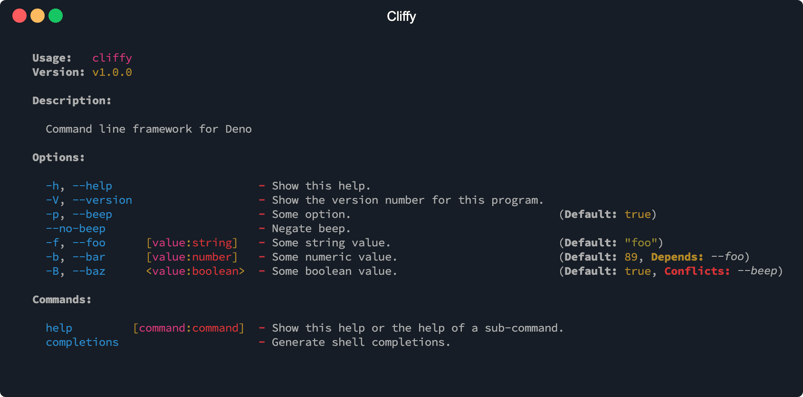
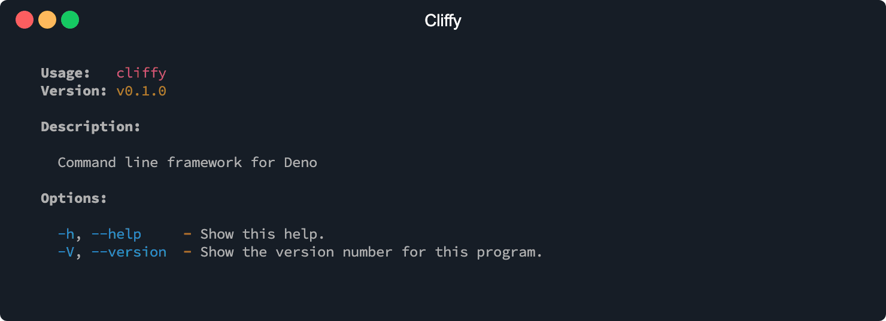
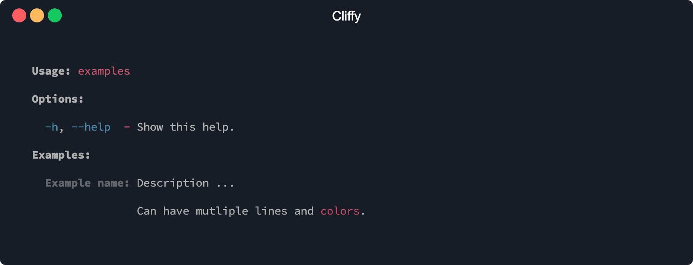
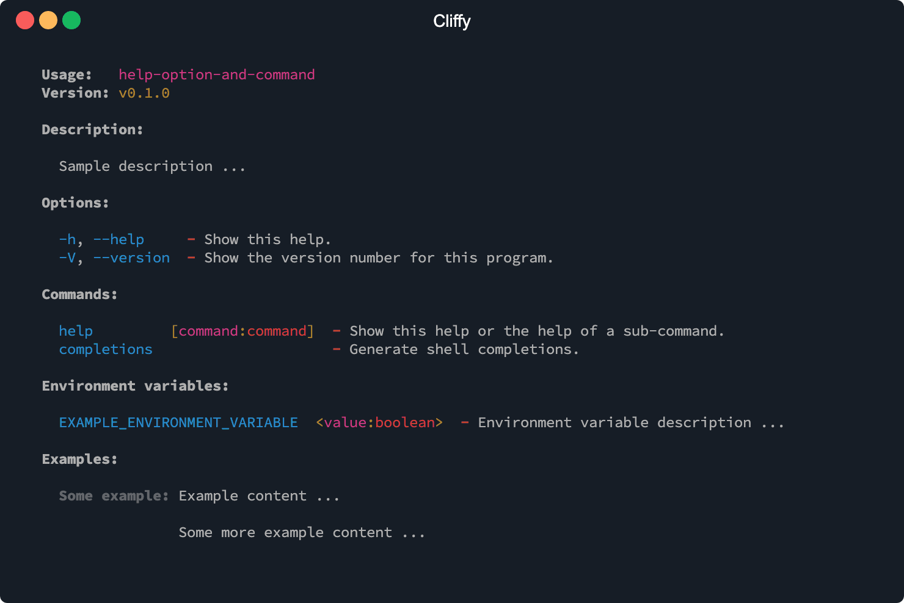

<h1 align="center">Cliffy ❯ Command</h1>

<p align="center" class="badges-container">
  <a href="https://github.com/c4spar/deno-cliffy/actions?query=workflow%3ATest">
    
  </a>
  <a href="https://github.com/c4spar/deno-cliffy/releases">
    
  </a>
  <a href="https://github.com/c4spar/deno-cliffy/labels/module%3Acommand">
    
  </a>
  <a href="https://deno.land/">
    
  </a>
  <a href="https://doc.deno.land/https/deno.land/x/cliffy/command/mod.ts">
    
  </a>
  <a href="https://discord.gg/nktwtG">
    
  </a>
  <a href="https://github.com/c4spar/deno-cliffy/actions?query=workflow%3Aci">
    
  </a>
  <a href="https://nest.land/package/cliffy">
    
  </a>
</p>

<p align="center">
  <b> The complete solution for <a href="https://deno.land/">Deno</a> command-line interfaces </b></br>
  <sub>>_ Create flexible command line interfaces with type checking, auto generated help and out of the box support for shell completions </sub>
</p>

<p align="center">
  
</p>

## ❯ Content

- [Install](#-install)
- [Usage](#-usage)
- [Options](#-options)
  - [Common option types: string, number and
    boolean](#common-option-types-string-number-and-boolean)
  - [List option types](#list-option-types)
  - [Variadic options](#variadic-options)
  - [Dotted options](#dotted-options)
  - [Default option value](#default-option-value)
  - [Required options](#required-options)
  - [Negatable options](#negatable-options)
  - [Global options](#global-options)
  - [Hidden options](#hidden-options)
  - [Standalone options](#standalone-options)
  - [Conflicting options](#conflicting-options)
  - [Depending options](#depending-options)
  - [Collect options](#collect-options)
  - [Custom option processing](#custom-option-processing)
  - [Option action handler](#option-action-handler)
- [Commands](#-commands)
  - [Argument syntax](#argument-syntax)
  - [Action handler](#action-handler)
  - [Executable sub-commands](#executable-sub-commands)
  - [Global commands](#global-commands)
  - [Hidden commands](#hidden-commands)
  - [Stop early](#stop-early)
  - [Error handling](#error-handling)
- [Custom types](#-custom-types)
  - [Function types](#function-types)
  - [Class types](#class-types)
  - [Global types](#global-types)
- [Environment variables](#-environment-variables)
- [Add examples](#-add-examples)
- [Auto generated help](#-auto-generated-help)
  - [Customize help](#customize-help)
  - [Help option](#help-option)
  - [Help command](#help-command)
- [Did you mean](#-did-you-mean)
- [Shell completion](#-shell-completion)
  - [Completions command](#completions-command)
    - [Bash Completions](#bash-completions)
    - [Fish Completions](#fish-completions)
    - [Zsh Completions](#zsh-completions)
- [Generic options and arguments](#-generic-options-and-arguments)
  - [Generic constructor types](#generic-constructor-types)
  - [Generic instance method types](#generic-instance-method-types)
  - [Generic global parent types](#generic-global-parent-types)
- [Version option](#-version-option)
- [Contributing](#-contributing)
- [License](#-license)

## ❯ Install

This module can be imported directly from the repo and from following
registries.

Deno Registry

```typescript
import { Command } from "https://deno.land/x/cliffy@<version>/command/mod.ts";
```

Nest Registry

```typescript
import { Command } from "https://x.nest.land/cliffy@<version>/command/mod.ts";
```

Github

```typescript
import { Command } from "https://raw.githubusercontent.com/c4spar/deno-cliffy/<version>/command/mod.ts";
```

## ❯ Usage

To create a program with cliffy you can import the `Command` class from the main
module `https://deno.land/x/cliffy/command/mod.ts` or directly from the command
module `https://deno.land/x/cliffy/command/command.ts`.

The `Command` class is used to create a new command or sub-command. The main
command has two predefined options, a global `--help` option which is available
on all child commands and a `--version` option which is only available on the
main command.

```typescript
import { Command } from "https://deno.land/x/cliffy/command/mod.ts";

await new Command()
  .name("cliffy")
  .version("0.1.0")
  .description("Command line framework for Deno")
  .parse(Deno.args);
```

```
$ deno run https://deno.land/x/cliffy/examples/command/usage.ts --help
```



## ❯ Options

Options are defined with the `.option()` method and can be accessed as
properties on the options object which is passed to the `.action()` handler and
returned by the `.parse()` method.

As first parameter of the `.options()` method you define the option names and
arguments. Each option can have multiple short and long flag's, separated by
comma. Multi-word options such as `--template-engine` are camel-cased, becoming
`options.templateEngine` and multiple short flags may be combined as a single
arg, for example `-abc` is equivalent to `-a -b -c` and `-n5` is equivalent to
`-n 5` and `-n=5`.

An option can have multiple required and optional arguments, separated by space.
Required values are declared using angle brackets `<>` and optional values with
square brackets `[]`.

The second parameter of the `.options()` method is the help description and the
thrid parameter can be an options object.

```typescript
import { Command } from "https://deno.land/x/cliffy/command";

const { options } = await new Command()
  .option("-s, --silent", "disable output.")
  .option("-d, --debug [level]", "output extra debugging.")
  .option("-p, --port <port>", "the port number.")
  .option("-h, --host [hostname]", "the host name.", { default: "localhost" })
  .option("-a, --allow [hostname]", "the host name.", { default: "localhost" })
  .parse(Deno.args);

console.log("server running at %s:%s", options.host, options.port);
```

```
$ deno run https://deno.land/x/cliffy/examples/command/options.ts -p 80
server running at localhost:80
```

The `.parse()` method processes all arguments, leaving any options consumed by
the command in the `options` object, all arguments in the `args` array and all
literal arguments in the literal array. For all unknown options the command will
throw an error message and exit the program with `Deno.exit(1)`.

### Common option types: string, number and boolean

Optionally you can declare a type after the argument name, separated by colon
`<name:type>`. If no type is specified, the type defaults to `string`. Following
types are availeble per default (_more will be added_):

- **string:** can be any value

- **number:** can be any numeric value

- **boolean:** can be one of: `true`, `false`, `1` or `0`,

```typescript
import { Command } from "https://deno.land/x/cliffy/command/mod.ts";

const { options } = await new Command()
  // optional boolean value
  .option("-s, --small [small:boolean]", "Small pizza size.")
  // required string value
  .option("-p, --pizza-type <type>", "Flavour of pizza.")
  // required number value
  .option("-a, --amount <amount:number>", "Pieces of pizza.")
  .parse(Deno.args);

console.log(options);
```

```
$ deno run https://deno.land/x/cliffy/examples/command/common_option_types.ts -p
Error: Missing value for option "--pizza-type".

$ deno run https://deno.land/x/cliffy/examples/command/common_option_types.ts -sp vegetarian --amount 3
{ small: true, pizzaType: "vegetarian", amount: 3 }
```

### List option types

Each type of option's can be a list of comma seperated items. The default
seperator is a `,` and can be changed with the `separator` option.

```typescript
import { Command } from "https://deno.land/x/cliffy/command/mod.ts";

const { options } = await new Command()
  // comma separated list
  .option("-l, --list <items:number[]>", "comma separated list of numbers.")
  // space separated list
  .option(
    "-o, --other-list <items:string[]>",
    "space separated list of strings.",
    { separator: " " },
  )
  .parse(Deno.args);

console.log(options);
```

```
$ deno run https://deno.land/x/cliffy/examples/command/list_option_type.ts -l 1,2,3
{ list: [ 1, 2, 3 ] }

$ deno run https://deno.land/x/cliffy/examples/command/list_option_type.ts -o "1 2 3"
{ otherList: [ "1", "2", "3" ] }
```

### Variadic options

The last argument of an option can be variadic, and only the last argument. To
make an argument variadic you append ... to the argument name. For example:

```typescript
import { Command } from "https://deno.land/x/cliffy/command/mod.ts";

const { options } = await new Command()
  .version("0.1.0")
  .option("-d, --dir [otherDirs...:string]", "Variadic option.")
  .parse(Deno.args);

console.log(options);
```

The variadic option is returned as an array.

```
$ deno run https://deno.land/x/cliffy/examples/command/variadic_options.ts -d dir1 dir2 dir3
{ dir: [ "dir1", "dir2", "dir3" ] }
```

### Dotted options

Dotted options allows you to group your options together in nested objects.
There is no limit for the level of nested objects.

```typescript
import { Command } from "https://deno.land/x/cliffy/command/mod.ts";

const { options } = await new Command()
  .option(
    "-b.a, --bitrate.audio, --audio-bitrate <bitrate:number>",
    "Audio bitrate",
  )
  .option(
    "-b.v, --bitrate.video, --video-bitrate <bitrate:number>",
    "Video bitrate",
  )
  .parse();

console.log(options);
```

```
$ deno run https://deno.land/x/cliffy/examples/command/dotted_options.ts -b.a 300 -b.v 900
{ bitrate: { audio: 300, video: 900 } }

$ deno run https://deno.land/x/cliffy/examples/command/dotted_options.ts --bitrate.audio 300 --bitrate.video 900
{ bitrate: { audio: 300, video: 900 } }

$ deno run https://deno.land/x/cliffy/examples/command/dotted_options.ts --audio-bitrate 300 --video-bitrate 900
{ bitrate: { audio: 300, video: 900 } }
```

### Default option value

You can specify a default value for an option with an optional value.

```typescript
import { Command } from "https://deno.land/x/cliffy/command/mod.ts";

const { options } = await new Command()
  .option("-c, --cheese [type:string]", "add the specified type of cheese", {
    default: "blue",
  })
  .parse(Deno.args);

console.log(`cheese: ${options.cheese}`);
```

```
$ deno run https://deno.land/x/cliffy/examples/command/default_option_value.ts
cheese: blue

$ deno run https://deno.land/x/cliffy/examples/command/default_option_value.ts --cheese mozzarella
cheese: mozzarella
```

### Required options

You may specify a required (mandatory) option.

```typescript
import { Command } from "https://deno.land/x/cliffy/command/mod.ts";

await new Command()
  .allowEmpty(false)
  .option("-c, --cheese [type:string]", "pizza must have cheese", {
    required: true,
  })
  .parse(Deno.args);
```

```
$ deno run https://deno.land/x/cliffy/examples/command/required_options.ts
Error: Missing required option "--cheese".
```

### Negatable options

You can specify a boolean option long name with a leading `no-` to set the
option value to false when used. Defined alone this also makes the option true
by default.

If you define `--foo`, adding `--no-foo` does not change the default value from
what it would otherwise be.

You can specify a default value for a flag and it can be overridden on command
line.

```typescript
import { Command } from "https://deno.land/x/cliffy/command/mod.ts";

const { options } = await new Command()
  // default value will be automatically set to true if no --check option exists
  .option("--no-check", "No check.")
  .option("--color <color:string>", "Color name.", { default: "yellow" })
  .option("--no-color", "No color.")
  // no default value
  .option("--remote <url:string>", "Remote url.")
  .option("--no-remote", "No remote.")
  .parse(Deno.args);

console.log(options);
```

```
$ deno run https://deno.land/x/cliffy/examples/command/negatable_options.ts
{ check: true, color: "yellow" }

$ deno run https://deno.land/x/cliffy/examples/command/negatable_options.ts --no-check --no-color --no-remote
{ check: false, color: false, remote: false }
```

### Global options

To share options with child commands you can use the `global` option.

```typescript
import { Command } from "https://deno.land/x/cliffy/command/mod.ts";

await new Command()
  .option("-l, --local [val:string]", "Only available on this command.")
  .option(
    "-g, --global [val:string]",
    "Available on this and all nested child command's.",
    { global: true },
  )
  .action(console.log)
  .command(
    "command1",
    new Command()
      .description("Some sub command.")
      .action(console.log)
      .command(
        "command2",
        new Command()
          .description("Some nested sub command.")
          .action(console.log),
      ),
  )
  .parse(Deno.args);
```

```
$ deno run https://deno.land/x/cliffy/examples/command/global_options.ts command1 command2 -g test
{ global: "test" }
```

### Hidden options

To exclude option's from the help and completion command's you can use the
`hidden` option.

```typescript
import { Command } from "https://deno.land/x/cliffy/command/mod.ts";

await new Command()
  .option("-H, --hidden [hidden:boolean]", "Nobody knows about me!", {
    hidden: true,
  })
  .parse(Deno.args);
```

```
$ deno run https://deno.land/x/cliffy/examples/command/hidden_options.ts -h
```

### Standalone options

Standalone options cannot be combine with any command and option. For example
the `--help` and `--version` flag. You can achieve this with the `standalone`
option.

```typescript
import { Command } from "https://deno.land/x/cliffy/command/mod.ts";

await new Command()
  .option("-s, --standalone [value:boolean]", "Some standalone option.", {
    standalone: true,
  })
  .option("-o, --other [value:boolean]", "Some other option.")
  .parse(Deno.args);
```

```
$ deno run https://deno.land/x/cliffy/examples/command/standalone_options.ts --standalone --other
Error: Option --standalone cannot be combined with other options.
```

### Conflicting options

To define options which conflicts with other options you can use the `conflicts`
option by defining an array with the names of these options.

```typescript
import { Command } from "https://deno.land/x/cliffy/command/mod.ts";

const { options } = await new Command()
  .option("-f, --file <file:string>", "read from file ...")
  .option("-i, --stdin [stdin:boolean]", "read from stdin ...", {
    conflicts: ["file"],
  })
  .parse(Deno.args);

console.log(options);
```

```
$ deno run https://deno.land/x/cliffy/examples/command/conflicting_options.ts -f file1
{ file: "file1" }

$ deno run https://deno.land/x/cliffy/examples/command/conflicting_options.ts -i
{ stdin: true }

$ deno run https://deno.land/x/cliffy/examples/command/conflicting_options.ts -if file1
Error: Option --stdin conflicts with option: --file
```

### Depending options

To define options which depends on other options you can use the `depends`
option by defining an array with the names of these options.

```typescript
import { Command } from "https://deno.land/x/cliffy/command/mod.ts";

const { options } = await new Command()
  .option("-u, --audio-codec <type:string>", "description ...")
  .option("-p, --video-codec <type:string>", "description ...", {
    depends: ["audio-codec"],
  })
  .parse(Deno.args);
```

```
$ deno run https://deno.land/x/cliffy/examples/command/depending_options.ts -a aac
{ audioCodec: "aac" }

$ deno run https://deno.land/x/cliffy/examples/command/depending_options.ts -v x265
Error: Option "--video-codec" depends on option "--audio-codec".

$ deno run https://deno.land/x/cliffy/examples/command/depending_options.ts -a aac -v x265
{ audioCodec: "aac", videoCodec: "x265" }
```

### Collect options

An option can occur multiple times in the command line to collect multiple
values. Todo this, you have to activate the `collect` option.

```typescript
import { Command } from "https://deno.land/x/cliffy/command/mod.ts";

const { options } = await new Command()
  .option("-c, --color <color:string>", "read from file ...", { collect: true })
  .parse(Deno.args);

console.log(options);
```

```
$ deno run https://deno.land/x/cliffy/examples/command/collect_options.ts --color yellow --color red --color blue
{ color: [ "yellow", "red", "blue" ] }
```

### Custom option processing

You may specify a function to do custom processing of option values. The
callback function receives one parameter, the user specified value which is
already parsed into the target type and it returns the new value for the option.

If collect is enabled the function receives as second parameter the previous
value.

This allows you to coerce the option value to the desired type, or accumulate
values, or do entirely custom processing.

```typescript
import { Command } from "https://deno.land/x/cliffy/command/mod.ts";

const { options } = await new Command()
  .option(
    "-o, --object <item:string>",
    "map string to object",
    (value: string): { value: string } => {
      return { value };
    },
  )
  .option("-C, --color <item:string>", "collect colors", {
    collect: true,
    value: (value: string, previous: string[] = []): string[] => {
      if (["blue", "yellow", "red"].indexOf(value) === -1) {
        throw new Error(
          `Color must be one of "blue, yellow or red", but got "${value}".`,
        );
      }
      previous.push(value);
      return previous;
    },
  })
  .parse(Deno.args);
```

```
$ deno run https://deno.land/x/cliffy/examples/command/custom_option_processing.ts --object a
{ object: { value: "a" } }

$ deno run https://deno.land/x/cliffy/examples/command/custom_option_processing.ts --color blue \
                                                                                   --color yellow \
                                                                                   --color red
{ color: [ "blue", "yellow", "red" ] }
```

### Option action handler

```typescript
import { Command } from "https://deno.land/x/cliffy/command/mod.ts";

await new Command()
  .version("0.1.0")
  .option("-i, --info [arg:boolean]", "Print some info.", {
    standalone: true,
    action: () => {
      console.log("Some info");
      Deno.exit(0);
    },
  })
  .parse(Deno.args);

console.log("not executed");
```

```
$ deno run https://deno.land/x/cliffy/examples/command/action_options.ts -i
Some info
```

## ❯ Commands

The command class acts like as a factory class. It has an internal command
pointer that points per default to the command instance itself. Each time the
`.command()` method is called, the internal pointer points to the newly created
command. All methods such as `.name()`, `.description()`, `.option()`,
`.action()`, etc... always work on the command to which the pointer points. If
you need to change the pointer back to the command instance you can call the
`.reset()` method.

```typescript
import { Command } from "https://deno.land/x/cliffy/command/mod.ts";

await new Command()
  .description("Main command.")
  .option("-a", "Main command option.")
  .command("command1 <file|dir>")
  .description("Command1 description.")
  .option("-b", "Command1 option.")
  .command("command2", new Command())
  .description("Command2 description.")
  .option("-c", "Command2 option.")
  .reset() // reset command pointer
  .option("-e", "Second main command option.")
  .parse(Deno.args);
```

There are three ways to specify sub-commands with the `.command()` method:

- Using an action handler attached to the command.
- Passing an `Command` instance as second argument to the `.command()` method.
- or by calling the `.executable()` method to execute a separate executable
  file.

In the first parameter to `.command()` you specify the command name and any
command arguments. The arguments may be `<required>` or `[optional]` and the
last argument may also be variadic. The second argumend of the `.command()`
method is optional and can be eather the command description or an instance of a
`Command` class. The description can be also defined with the `.description()`
method.

Sub-command implemented using the `.command()` method with an action handler.

```typescript
import { Command } from "https://deno.land/x/cliffy/command/mod.ts";

await new Command()
  .command(
    "clone <source:string> [destination:string]",
    "Clone a repository into a newly created directory.",
  )
  .action((options: any, source: string, destination: string) => {
    console.log("clone command called");
  })
  .parse(Deno.args);
```

Sub-command implemented using a `Command` instance.

```typescript
import { Command } from "https://deno.land/x/cliffy/command/mod.ts";

const clone = new Command()
  .arguments("<source:string> [destination:string]")
  .description("Clone a repository into a newly created directory.")
  .action((options: any, source: string, destination: string) => {
    console.log("clone command called");
  });

await new Command()
  .command("clone", clone)
  .parse(Deno.args);
```

Sub-command implemented using a separate executable file.

```typescript
import { Command } from "https://deno.land/x/cliffy/command/mod.ts";

await new Command()
  .command("start <service>", "Start named service.")
  .executable()
  .command(
    "stop [service]",
    new Command()
      .description("Stop named service, or all if no name supplied.")
      .executable(),
  )
  .parse(Deno.args);
```

### Argument syntax

You can use `.arguments()` to specify the arguments for the top-level and for
sub-commands. For sub-commands they can also be included in the `.command()`
call. Angled brackets (e.g. `<required>`) indicate required input and square
brackets (e.g. `[optional]`) indicate optional input. A required input cannot be
defined after an optional input.

```typescript
import { Command } from "https://deno.land/x/cliffy/command/mod.ts";

const { args } = await new Command()
  .arguments("<cmd> [env]")
  .parse(Deno.args);
```

```
$ deno run https://deno.land/x/cliffy/examples/command/arguments_syntax.ts
Error: Missing argument(s): cmd
```

The last argument of a command can be variadic, and only the last argument. To
make an argument variadic you can append or prepand `...` to the argument name.
The variadic argument is passed to the action handler as an array.

```typescript
import { Command } from "https://deno.land/x/cliffy/command/mod.ts";

await new Command()
  .command("rmdir <dirs...:string>", "Remove directories.")
  .action((_, dirs: string[]) => {
    dirs.forEach((dir: string) => {
      console.log("rmdir %s", dir);
    });
  })
  .parse(Deno.args);
```

```
$ deno run https://deno.land/x/cliffy/examples/command/arguments_syntax_variadic.ts rmdir dir1 dir2 dir3  
rmdir dir1  
rmdir dir2  
rmdir dir3
```

You can also use types for arguments same as for options and environment
variables. Custom types are also supported.

```typescript
import { Command } from "https://deno.land/x/cliffy/command/mod.ts";

await new Command()
  .command("rmdir <dir:string>")
  .action((options: any, dir: string) => {
    console.log("rmdir %s", dir);
  })
  .parse(Deno.args);
```

### Action handler

The action handler is called when the command is executed. It gets passed an
object with all options defined by the user and additional arguments which are
passed to the command.

```typescript
import { Command } from "https://deno.land/x/cliffy/command/mod.ts";

await new Command()
  .command("rm <dir>", "Remove directory.")
  .option("-r, --recursive [recursive:boolean]", "Remove recursively")
  .action(({ recursive }: any, dir: string) => {
    console.log("remove " + dir + (recursive ? " recursively" : ""));
  })
  .parse(Deno.args);
```

```
$ deno run https://deno.land/x/cliffy/examples/command/action_handler.ts rm dir
remove dir

$ deno run https://deno.land/x/cliffy/examples/command/action_handler.ts rm dir -r
remove dir recursively
```

### Executable sub-commands

> Work in progress

When `.executable()` is invoked on a sub-command, this tells cliffy you're going
to use a separate executable file for the sub-command. Cliffy will search the
executable in the directory of the entry script with the name
program-sub-command, like `pm-install`, `pm-search`. If no command was found
cliffy looks for a globally installed command.

You handle the options for an executable (sub)command in the executable, and
don't declare them at the top-level.

```typescript
import { Command } from "https://deno.land/x/cliffy/command/mod.ts";

await new Command()
  .command("install [name]", "install one or more packages").executable()
  .command("search [query]", "search with optional query").executable()
  .command("update", "update installed packages").executable()
  .command("list", "list packages installed").executable()
  .parse(Deno.args);
```

### Global commands

To share commands with child commands you can use the `.global()` method.

```typescript
import { Command } from "https://deno.land/x/cliffy/command/mod.ts";

await new Command()
  .command("global [val:string]", "global ...")
  .global()
  .action(console.log)
  .command(
    "command1",
    new Command()
      .description("Some sub command.")
      .command(
        "command2",
        new Command()
          .description("Some nested sub command."),
      ),
  )
  .parse(Deno.args);
```

```
$ deno run https://deno.land/x/cliffy/examples/command/global_commands.ts command1 command2 global test
{} test
```

### Hidden commands

To exclude commands's from the help and completion command's you can use the
`.hidden()` method.

```typescript
import { Command } from "https://deno.land/x/cliffy/command/mod.ts";

await new Command()
  .command("top-secret", "Nobody knows about me!")
  .hidden()
  .parse(Deno.args);
```

```
$ deno run https://deno.land/x/cliffy/examples/command/hidden_commands.ts -h
```

### Stop early

If enabled, all arguments starting from the first non option argument will be
interpreted as raw argument.

```typescript
import { Command } from "https://deno.land/x/cliffy/command/mod.ts";

await new Command()
  .stopEarly() // <-- enable stop early
  .option("-d, --debug-level <level:string>", "Debug level.")
  .arguments("[script:string] [...args:number]")
  .action((options: any, script: string, args: string[]) => {
    console.log("options:", options);
    console.log("script:", script);
    console.log("args:", args);
  })
  .parse(Deno.args);
```

```
$ deno run https://deno.land/x/cliffy/examples/command/stop_early.ts -d warning server -p 80
options: { debugLevel: "warning" }
script: server
args: [ "-p", "80" ]
```

### Error handling

By default, cliffy calls `Deno.exit` when a `ValidationError` is thrown. You can
override this behaviour with the `.throwErrors()` method. All other errors will
be thrown by default.

**Catch runtime errors**

```typescript
import { Command } from "https://deno.land/x/cliffy/command/mod.ts";

const cmd = new Command()
  .option("-p, --pizza-type <type>", "Flavour of pizza.")
  .action(() => {
    throw new Error("Some error happened.");
  });

try {
  cmd.parse();
} catch (error) {
  console.error("[CUSTOM_ERROR]", error);
  Deno.exit(1);
}
```

```textile
$ deno run https://deno.land/x/cliffy/examples/command/general_error_handling.ts -t
Unknown option "-t". Did you mean option "-h"?
```

```textile
$ deno run https://deno.land/x/cliffy/examples/command/general_error_handling.ts
[CUSTOM_ERROR] Some error happened.
```

**Catch validation errors**

```typescript
import {
  Command,
  ValidationError,
} from "https://deno.land/x/cliffy/command/mod.ts";

const cmd = new Command()
  .throwErrors() // <-- throw also validation errors.
  .option("-p, --pizza-type <type>", "Flavour of pizza.")
  .action(() => {
    throw new Error("Some error happened.");
  });

try {
  cmd.parse();
} catch (error) {
  if (error instanceof ValidationError) {
    cmd.help();
    console.error("[CUSTOM_VALIDATION_ERROR]", error.message);
  } else {
    console.error("[CUSTOM_ERROR]", error);
  }
  Deno.exit(1);
}
```

```textile
$ deno run https://deno.land/x/cliffy/examples/command/validation_error_handling.ts -t
[CUSTOM_VALIDATION_ERROR] Unknown option "-t". Did you mean option "-h"?
```

## ❯ Custom types

You can register custom types with the `.type()` method. The first argument is
the name of the type, the second can be either a function or an instance of
`Type` and the third argument can be an options object.

### Function types

This example shows you how to use a function as type handler.

```typescript
import { Command } from "https://deno.land/x/cliffy/command/mod.ts";
import { IType } from "https://deno.land/x/cliffy/flags/mod.ts";

const emailRegex =
  /^(([^<>()\[\]\\.,;:\s@"]+(\.[^<>()\[\]\\.,;:\s@"]+)*)|(".+"))@((\[[0-9]{1,3}\.[0-9]{1,3}\.[0-9]{1,3}\.[0-9]{1,3}\])|(([a-zA-Z\-0-9]+\.)+[a-zA-Z]{2,}))$/;

function emailType({ label, name, value }: ITypeInfo): string {
  if (!emailRegex.test(value.toLowerCase())) {
    throw new Error(
      `${label} "${name}" must be a valid "email", but got "${value}".`,
    );
  }

  return value;
}

const { options } = await new Command()
  .type("email", emailType)
  .arguments("[email:email]")
  .option("-e, --email <value:email>", "Your email address.")
  .command("email [email:email]", "Your email address.")
  .parse(Deno.args);
```

```
$ deno run https://deno.land/x/cliffy/examples/command/custom_option_type.ts -e "my@email.com"
{ email: "my@email.com" }
```

```
$ deno run https://deno.land/x/cliffy/examples/command/custom_option_type.ts -e "my @email.com"
Error: Option "--email" must be a valid "email", but got "my @email.com".
```

### Class types

This example shows you how to use a class as type handler.

```typescript
import { Command, Type } from "https://deno.land/x/cliffy/command/mod.ts";
import { IType } from "https://deno.land/x/cliffy/flags/mod.ts";

class EmailType extends Type<string> {
  protected emailRegex =
    /^(([^<>()\[\]\\.,;:\s@"]+(\.[^<>()\[\]\\.,;:\s@"]+)*)|(".+"))@((\[[0-9]{1,3}\.[0-9]{1,3}\.[0-9]{1,3}\.[0-9]{1,3}\])|(([a-zA-Z\-0-9]+\.)+[a-zA-Z]{2,}))$/;

  public parse({ label, name, value }: ITypeInfo): string {
    if (!this.emailRegex.test(value.toLowerCase())) {
      throw new Error(
        `${label} "${name}" must be a valid "email", but got "${value}".`,
      );
    }

    return value;
  }
}

const { options } = await new Command()
  .type("email", new EmailType())
  .arguments("[email:email]")
  .option("-e, --email <value:email>", "Your email address.")
  .command("email [email:email]", "Your email address.")
  .parse(Deno.args);
```

```
$ deno run https://deno.land/x/cliffy/examples/command/custom_option_type_class.ts -e "my@email.de"
{ email: "my@email.de" }
```

```
$ deno run https://deno.land/x/cliffy/examples/command/custom_option_type_class.ts -e "my @email.de"
Error: Option "--email" must be a valid "email", but got "my @email.de".
```

### Global types

To make an type available for child commands you can set the `global` option in
the options argument.

```typescript
await new Command()
  .type("email", new EmailType(), { global: true })
  .command("login", "Login with email.")
  .option("-e, --email <email:email>", "Your email address.")
  .action(console.log)
  .command("config", "Manage config.")
  .option("-a, --admin-email [email:email]", "Get or set admin email address.")
  .action(console.log)
  .parse(Deno.args);
```

```
$ deno run https://deno.land/x/cliffy/examples/command/global_custom_type.ts login --email "my@email.de"
{ email: "my@email.de" }
```

## ❯ Environment variables

You can define environment variables for a command that are validated when the
command is executed. Environment variables are listed with the
[help](#help-option-and-command) option and command. An environment variable can
be marked as `global` and `hidden`. `hidden` variables are not listed in the
help output and `global` variables are validated for the command for which they
are registered and for all nested child commands.

To allow deno to access environment variables you have to set the `--allow-env`
flag. At the moment its also required to set the `--unstable` flag because
deno's permissions api is marked as unstable.

```typescript
import { Command } from "https://deno.land/x/cliffy/command/mod.ts";

await new Command()
  .env("SOME_ENV_VAR=<value:number>", "Description ...", {
    global: true,
    hidden: false,
  })
  .command("hello", "world ...")
  .parse(Deno.args);

console.log(Deno.env.get("SOME_ENV_VAR"));
```

```
$ SOME_ENV_VAR=1 deno run --allow-env --unstable https://deno.land/x/cliffy/examples/command/environment_variables.ts
1

$ SOME_ENV_VAR=abc deno run --allow-env --unstable https://deno.land/x/cliffy/examples/command/environment_variables.ts
Error: Environment variable "SOME_ENV_VAR" must be of type "number", but got "abc".
```

## ❯ Add examples

You can add some examples for your command which will be printed with the
[help](#help-option-and-command) option and command.

```typescript
import { red } from "https://deno.land/std/fmt/colors.ts";
import { Command } from "https://deno.land/x/cliffy/command/mod.ts";

await new Command()
  .name("examples")
  .example(
    "example name",
    `Description ...\n\nCan have mutliple lines and ${red("colors")}.`,
  )
  .parse(Deno.args);
```

```
$ deno run https://deno.land/x/cliffy/examples/command/examples.ts help
```



## ❯ Auto generated help

The help information is auto-generated based on the information you have defined
on your command's.

```typescript
import { Command } from "https://deno.land/x/cliffy/command/command.ts";
import { CompletionsCommand } from "https://deno.land/x/cliffy/command/completions/mod.ts";
import { CompletionsCommand } from "https://deno.land/x/cliffy/command/help/mod.ts";

await new Command()
  .name("help-option-and-command")
  .version("0.1.0")
  .description("Sample description ...")
  .env(
    "EXAMPLE_ENVIRONMENT_VARIABLE=<value:boolean>",
    "Environment variable description ...",
  )
  .example(
    "Some example",
    "Example content ...\n\nSome more example content ...",
  )
  .command("help", new HelpCommand())
  .command("completions", new CompletionsCommand())
  .parse(Deno.args);
```

```
$ deno run https://deno.land/x/cliffy/examples/command/help_option_and_command.ts --help
```



### Customize help

Customize default help with the `.help()` method.

```typescript
import { Command } from "https://deno.land/x/cliffy/command/command.ts";

await new Command()
  .help({
    // Show argument types.
    types: true, // default: false
    // Show hints.
    hints: true, // default: true
  })
  .option("-f, --foo [val:number]", "Some description.", {
    required: true,
    default: 2,
  })
  .parse();
```

You can also override the help output with the `.help()` method. This overrides
the output of the `.getHelp()` and `.showHelp()` method's which is used by the
`-h` and `--help` option and the `help` command. The help handler will be used
for each command, but can be overridden by child commands.

```typescript
import { Command } from "https://deno.land/x/cliffy/command/command.ts";

await new Command()
  .help("My custom help")
  // Can be also a function.
  .help(() => "My custom help")
  .parse();
```

### Help option

The `--help` and `-h` option flag prints the auto generated help.

#### Customize help option

The help option is completely customizable with the `.helpOption()` method. The
first argument are the flags followed by the description. The third argument can
be an action handler or an options object. The second and third argument's are
optional.

```typescript
await new Command()
  .helpOption("-i, --info", "Print help info.", function (this: Command) {
    console.log("some help info ...", this.getHelp());
  })
  .parse(Deno.args);
```

You can also override the default options of the help option. The options are
the same as for the `.option()` method.

```typescript
await new Command()
  .helpOption(" -x, --xhelp", "Print help info.", { global: true })
  .parse(Deno.args);
```

To disable the help option you can pass false to the `.helpOption()` method.

```typescript
await new Command()
  .helpOption(false)
  .parse(Deno.args);
```

### Help command

There is also a predefined `HelpCommand` which prints the auto generated help.
The help command must be registered manuelly and can be optionally registered as
global command to make them also available on all child commands.

```typescript
import {
  Command,
  HelpCommand,
} from "https://deno.land/x/cliffy/command/mod.ts";

await new Command()
  .version("0.1.0")
  .description("Sample description ...")
  .env(
    "EXAMPLE_ENVIRONMENT_VARIABLE=<value:boolean>",
    "Environment variable description ...",
  )
  .command("help", new HelpCommand().global())
  .parse(Deno.args);
```

The `help` command excepts the name of a sub-command as optional argument to
show the help of the given sub-command.

```
$ deno run https://deno.land/x/cliffy/examples/command/help_option_and_command.ts help
$ deno run https://deno.land/x/cliffy/examples/command/help_option_and_command.ts help completions
$ deno run https://deno.land/x/cliffy/examples/command/help_option_and_command.ts completions help
```

## ❯ Did you mean

Cliffy has build-in _did-you-mean_ support to improve the user and developer
experience. For example, cliffy prints some suggestions, when the user executes
an invalid command, or the developer has a typo in the name of a type.

```
$ deno run https://deno.land/x/cliffy/examples/command/demo.ts -g
error: Unknown option "-g". Did you mean option "-h"?
```

## ❯ Shell completion

Cliffy supports shell completion out of the box.

**Currently supported shells**

- bash
- fish
- zsh

There are two ways to add auto-completion to types. One option is adding a
completion action. A completion action is declared with the `.complete()` method
and can be used in the command arguments declaration and by any option. The
action is added after the type separated by colon.

```typescript
import { Command, Type } from "https://deno.land/x/cliffy/command/mod.ts";

await new Command()
  .complete("email", () => ["aaa@example.com", "bbb@example.com"])
  .arguments("[value:string:email]")
  .option("-e, --email <value:string:email>", "Your email address.")
  .parse(Deno.args);
```

Another way to add shell completion is by creating a custom type class with a
`.complete()` method.

```typescript
import { Command, StringType } from "https://deno.land/x/cliffy/command/mod.ts";

class EmailType extends StringType {
  complete(): string[] {
    return ["aaa@example.com", "bbb@example.com", "ccc@example.com"];
  }
}

await new Command()
  .type("email", new EmailType())
  .option("-e, --email <value:email>", "Your email address.")
  .parse(Deno.args);
```

Enabling auto completion is explained in the
[completions command](#completions-command) section.

### Completions command

The `CompetionsCommand` command generates the shell completions script for your
program. To do so, you have to register the completions command on your
programm.

```typescript
import {
  Command,
  CompletionsCommand,
} from "https://deno.land/x/cliffy/command/mod.ts";

await new Command()
  .command("completions", new CompletionsCommand())
  .parse(Deno.args);
```

By calling `command-name completions <shell>`, the command will output the
completions script to the stdout.

#### Bash Completions

To enable bash completions for your program add the following line to your
`~/.bashrc`:

```shell
source <(command-name completions bash)
```

#### Fish Completions

To enable fish completions for your program add the following line to your
`~/.config/fish/config.fish`:

```shell script
source (command-name completions fish | psub)
```

#### Zsh Completions

To enable zsh completions for your program add the following line to your
`~/.zshrc`:

```shell script
source <(command-name completions zsh)
```

## ❯ Generic options and arguments

By default, options and arguments are of type `any`. You can define strict types
by passing the types to the constructor `new Command<O, A, G>()` or to the
instance methods `.option<O>()`, `.arguments<A>()` and `.globalOption<O>()`.

Options must be compatible to `Record<string, unknown>` (or `void` for no
options) and argument to `Array<unknown>` (or an empty tuple `[]` for no
arguments).

> ⚠️ Don't use the `{}` type to define an empty options object, because it
> doesn't mean to be an empty object. (see
> [here](https://github.com/typescript-eslint/typescript-eslint/issues/2063#issuecomment-675156492)
> for more information), instead use `void`.

### Generic constructor types

The `Command<O, A, G>` constructor takes multiple generic types (5), but you
only need the first 3 types. The last 2 types are only used internally.

The first type is to define the command options type, the second for the command
arguments and the third to define global parent options. The third type is only
needed, if you want to split your command into multiple command instances.

```typescript
import {
  Command,
  IParseResult,
} from "https://deno.land/x/cliffy/command/mod.ts";

// Define your argument types.
type Arguments = [input: string, output?: string];

// Define your option types.
interface Options {
  name: string;
  age: number;
  email?: string;
}

const result: IParseResult<Options, Arguments> = await new Command<
  Options,
  Arguments
>()
  .arguments("<input:string> [output:string]")
  .option("-n, --name <name:string>", "description ...", { required: true })
  .option("-a, --age <age:number>", "description ...", { required: true })
  .option("-e, --email <email:string>", "description ...")
  .action((options: Options, input: string, output?: string) => {})
  .action((options) => {
    /** valid options */
    options.name && options.age &&
      options.email;
    /** invalid options */
    // @ts-expect-error option foo does not exist.
    options.foo;
  })
  .parse(Deno.args);

const options: Options = result.options;
const input: string = result.args[0];
const output: string | undefined = result.args[1];
```

### Generic instance method types

By default, the type of the command options and arguments is `any`. To start
with an empty command with no options and no arguments, you can pass the `void`
type to the command constructor. Then you can add dynamically new option and
argument types by passing the types to the `.option<O>()`, `.arguments<A>()` and
`.globalOption<O>()` method's.

```typescript
import { Command } from "https://deno.land/x/cliffy/command/mod.ts";

new Command<void>()
  .arguments<[input: string, output?: string]>("<input> [output]")
  .globalOption<{ debug?: boolean }>("-d, --debug", "...")
  .option<{ logLevel?: boolean }>("-L, --log-level", "...", { global: true })
  .option<{ main?: boolean }>("-m, --main", "...")
  .action((options) => {
    /** valid options */
    options.debug && options.logLevel &&
      options.main;
    /** invalid options */
    // @ts-expect-error foo & fooGlobal option's only exists on foo command.
    options.foo && options.fooGlobal &&
      // @ts-expect-error bar & barGlobal option's only exists on bar command.
      options.bar && options.barGlobal;
  })
  .command("foo")
  .globalOption<{ fooGlobal?: boolean }>("-F, --foo-global", "...")
  .option<{ foo?: boolean }>("-f, --foo", "...")
  .action((options) => {
    /** valid options */
    options.debug && options.logLevel &&
      options.foo && options.fooGlobal;
    /** invalid options */
    // @ts-expect-error main option only exists on main command.
    options.main &&
      // @ts-expect-error bar & barGlobal option's only exists on bar command.
      options.bar && options.barGlobal;
  })
  .command("bar")
  .globalOption<{ barGlobal?: boolean }>("-B, --bar-global", "...")
  .option<{ bar?: boolean }>("-b, --bar", "...")
  .action((options) => {
    /** valid options */
    options.debug && options.logLevel &&
      options.bar && options.barGlobal;
    /** invalid options */
    // @ts-expect-error main option only exists on main command.
    options.main &&
      // @ts-expect-error foo & fooGlobal option's only exists on foo command.
      options.foo && options.fooGlobal;
  });
```

### Generic global parent types

If you want to split up your command into different command instances, to
organize your commands into different files, you can define required global
parent options in the constructor of the child command.

> foo.ts

```typescript
import { Command } from "https://deno.land/x/cliffy/command/mod.ts";

// Define global parent option `debug`.
export const fooCommand = new Command<void, [], { debug?: boolean }>()
  // Add foo command options.
  .option<{ bar?: boolean }>("-b, --bar", "...")
  .action((options) => {
    if (options.debug) {
      console.log("debug");
    }
    if (options.bar) {
      console.log("bar");
    }
  });
```

> main.ts

```typescript
import { Command } from "https://deno.land/x/cliffy/command/mod.ts";
import { fooCommand } from "./foo.ts";

await new Command<void>()
  // Add global option.
  .globalOption<{ debug?: boolean }>("-d, --debug", "...")
  .command("foo", fooCommand)
  .parse(Deno.args);
```

## ❯ Version option

The `--version` and `-V` option flag prints the version number defined with the
`version()` method. The version number will also be printed within the output of
the [help](#help-option-command) option and command.

```typescript
import { Command } from "https://deno.land/x/cliffy/command/mod.ts";

await new Command()
  .version("0.1.0")
  .parse(Deno.args);
```

```
$ deno run https://deno.land/x/cliffy/examples/command/version_options.ts -V
$ deno run https://deno.land/x/cliffy/examples/command/version_options.ts --version
0.0.1
```

### Customize version option

The version option is completely customizable with the `.versionOption()`
method. The first argument are the flags followed by the description. The third
argument can be an action handler or an options object. The second and third
argument's are optional.

```typescript
await new Command()
  .version("0.1.0")
  .versionOption(
    " -x, --xversion",
    "Print version info.",
    function (this: Command) {
      console.log("Version: %s", this.getVersion());
    },
  )
  .parse(Deno.args);
```

You can also override the default options of the version option. The options are
the same as for the `.option()` method.

```typescript
await new Command()
  .version("0.1.0")
  .versionOption(" -x, --xversion", "Print version info.", { global: true })
  .parse(Deno.args);
```

The version option can be also disabled.

```typescript
await new Command()
  .versionOption(false)
  .parse(Deno.args);
```

## ❯ Contributing

Any kind of contribution is welcome! Please take a look at the
[contributing guidelines](../CONTRIBUTING.md).

## ❯ License

[MIT](../LICENSE)
