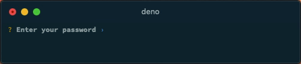
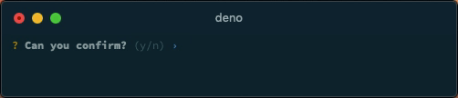
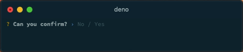
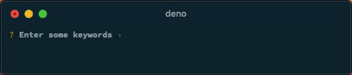
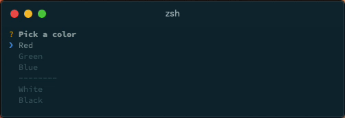

<h1 align="center">Cliffy ❯ Prompt</h1>

<p align="center">
  <a href="https://github.com/c4spar/deno-cliffy/releases">
    
  </a>
  <a href="https://github.com/c4spar/deno-cliffy/releases">
    
  </a>
  <a href="https://deno.land/">
    
  </a>
  <a href="https://github.com/c4spar/deno-cliffy/actions?query=workflow%3Aci">
    
  </a>
  <a href="https://github.com/c4spar/deno-cliffy/labels/module%3Aprompt">
    
  </a>
  <a href="https://github.com/c4spar/deno-cliffy/actions?query=workflow%3Aci">
    
  </a>
</p>

<p align="center">
  <b> Create beautiful interactive prompts</b></br>
  <sub>>_ Input, Number, Confirm, Toggle, List, Select, Checkbox and many more...<sub>
</p>

## ❯ Content

* [Usage](#-usage)
* [Types](#-types)

## ❯ Usage

### Single Prompt

Execute a single prompt with a single message which returns the user input.

```typescript
const name: string = await Input.prompt(`What's your name?`);
```

Execute a single prompt with an options object.

```typescript
const name: string = await Input.prompt({message: `What's your name?`});
```

### Prompt Chain

> Work in progress

### Prompt List

> Work in progress

### Dynamic Prompts

> Work in progress

## ❯ Types

* [input](#%EF%B8%8F-input)
* [number](#-number)
* [secret](#-secret)
* [confirm](#-confirm)
* [toggle](#-toggle)
* [list](#-list)
* [select](#-select)
* [checkbox](#%EF%B8%8F-checkbox)

#### Base Options

All prompts have the following base options:

| Param | Type | Required | Description |
| ----- | :--: | :--: | ----------- |
| message | `string` | Yes | Prompt message to display. |
| default | `T` | No | Default value. Type depends on prompt type. |
| transform | `(value: V) => T \| undefined` | No | Receive user input. The returned value will be returned by the `.prompt()` method. |
| validate | `(value: T \| undefined) => ValidateResult` | No | Receive sanitized user input. Should return `true` if the value is valid, and an error message `String` otherwise. If `false` is returned, a default error message is shown |
| hint | `string` | No | Hint to display to the user. (not implemented) |
| pointer | `string` | No | Change the pointer icon. |

***

### ✏️ Input

**Example**


```typescript
import { Input } from 'https://deno.land/x/cliffy/prompt.ts';

const name: string = await Input.prompt( `What's your github user name?` );
```

```
$ deno run --unstable https://deno.land/x/cliffy/examples/prompt/input.ts
```

**Options**

The `Input` prompt has all [base](#base-options) and the following prompt specific options.

| Param | Type | Required | Description |
| ----- | :--: | :--: | ----------- |
| minLength | `number` | No | Min length of value. Defaults to `0`. |
| maxLength | `number` | No | Max length of value. Defaults to `infinity`. |

**↑ back to:** [Prompt types](#-types)

***

### 💯 Number

**Example**


```typescript
import { Number } from 'https://deno.land/x/cliffy/prompt.ts';

const age: number = await Number.prompt( `How old are you?` );
```

```
$ deno run --unstable https://deno.land/x/cliffy/examples/prompt/number.ts
```

**Options**

The `Number` prompt has all [base options](#base-options) and the following prompt specific options.

| Param | Type | Required | Description |
| ----- | :--: | :--: | ----------- |
| min | `number` | No | Min value. Defaults to `-infinity`. |
| max | `number` | No | Max value. Defaults to `Infinity`. |
| float | `boolean` | No | Allow floating point inputs. Defaults to `false`. |
| round | `number` | No | Round float values to `x` decimals. Defaults to `2`. |

**↑ back to:** [Prompt types](#-types)

***

### 🔑 Secret

**Example**



```typescript
import { Secret } from 'https://deno.land/x/cliffy/prompt.ts';

const password: string = await Secret.prompt( `Enter your password` );
```

```
$ deno run --unstable https://deno.land/x/cliffy/examples/prompt/secret.ts
```

**Options**

The `Secret` prompt has all [base options](#base-options) and the following prompt specific options.

| Param | Type | Required | Description |
| ----- | :--: | :--: | ----------- |
| label | `string` | No | Name of secret. Defaults to `Password`. |
| hidden | `number` | No | Hide input during typing and show a fix number of asterisk's on success. |
| minLength | `number` | No | Min length of secret value. Defaults to `0`. |
| maxLength | `number` | No | Max length of secret value. Defaults to `infinity`. |

**↑ back to:** [Prompt types](#-types)

***

### 👌 Confirm

**Example**



```typescript
import { Confirm } from 'https://deno.land/x/cliffy/prompt.ts';

const confirmed: boolean = await Confirm.prompt( `Can you confirm?` );
```

```
$ deno run --unstable https://deno.land/x/cliffy/examples/prompt/confirm.ts
```

**Options**

The `Config` prompt has all [base options](#base-options) and the following prompt specific options.

| Param | Type | Required | Description |
| ----- | :--: | :--: | ----------- |
| active | `string` | No | Text for `active` state. Defaults to `'Yes'`. |
| inactive | `string` | No | Text for `inactive` state. Defaults to `'No'`. |

**↑ back to:** [Prompt types](#-types)

***

### 🔘 Toggle

**Example**



```typescript
import { Toggle } from 'https://deno.land/x/cliffy/prompt.ts';

const confirmed: boolean = await Toggle.prompt( `Can you confirm?` );
```

```
$ deno run --unstable https://deno.land/x/cliffy/examples/prompt/toggle.ts
```

**Options**

The `Toggle` prompt has all [base options](#base-options) and the following prompt specific options.

| Param | Type | Required | Description |
| ----- | :--: | :--: | ----------- |
| active | `string` | No | Text for `active` state. Defaults to `'Yes'`. |
| inactive | `string` | No | Text for `inactive` state. Defaults to `'No'`. |

**↑ back to:** [Prompt types](#-types)

***

### 📃 List

**Example**



```typescript
import { List } from 'https://deno.land/x/cliffy/prompt.ts';

const keywords: string[] = await List.prompt( `Enter some keywords` );
```

```
$ deno run --unstable https://deno.land/x/cliffy/examples/prompt/list.ts
```

The `List` prompt has all [base options](#base-options) and the following prompt specific options.

**Options**

| Param | Type | Required | Description |
| ----- | :--: | :--: | ----------- |
| separator | `string` | No | String separator. Will trim all white-spaces from start and end of string. Defaults to `','`. |
| minLength | `number` | No | Min length of a single tag. Defaults to `0`. |
| maxLength | `number` | No | Max length of a single tag. Defaults to `infinity`. |
| minTags | `number` | No | Min number of tags. Defaults to `0`. |
| maxTags | `number` | No | Max number of tags. Defaults to `infinity`. |

**↑ back to:** [Prompt types](#-types)

***

### ❯ Select

**Example**



```typescript
import { Select } from 'https://deno.land/x/cliffy/prompt.ts';

const color: string = await Select.prompt( {
    message: `Pick a color`,
    options: [
        { name: 'Red', value: '#ff0000' },
        { name: 'Green', value: '#00ff00', disabled: true },
        { name: 'Blue', value: '#0000ff' },
        Select.separator( '--------' ),
        { name: 'White', value: '#ffffff' },
        { name: 'Black', value: '#000000' }
    ]
} );
```

```
$ deno run --unstable https://deno.land/x/cliffy/examples/prompt/select.ts
```

**Options**

The `Select` prompt has all [base options](#base-options) and the following prompt specific options.

| Param | Type | Required | Description |
| ----- | :--: | :--: | ----------- |
| options | `(string \| Option)[]` | Yes | Array of string's or Option's. |
| maxRows | `number` | No | Number of options displayed per page. Defaults to `10`. |
| indent | `string` | No | List indentation. Defaults to `' '` |
| listPointer | `string` | No | Change the list pointer icon. |

**`Option` Options**

| Param | Type | Required | Description |
| ----- | :--: | :--: | ----------- |
| value | `string` | Yes | Value which will be returned as result. |
| name | `string` | No | Name is displayed in the list. Defaults to `value` |
| disabled | `boolean` | No | Disabled item. Can't be selected. |

**↑ back to:** [Prompt types](#-types)

***

### ✔️ Checkbox

**Example**


```typescript
import { Checkbox } from 'https://deno.land/x/cliffy/prompt.ts';

const colors: string[] = await Checkbox.prompt( {
    message: `Pick a color`,
    options: [
        { name: 'Red', value: '#ff0000' },
        { name: 'Green', value: '#00ff00', disabled: true },
        { name: 'Blue', value: '#0000ff' },
        Checkbox.separator( '--------' ),
        { name: 'White', value: '#ffffff' },
        { name: 'Black', value: '#000000' }
    ]
} );
```

```
$ deno run --unstable https://deno.land/x/cliffy/examples/prompt/checkbox.ts
```

**Options**

The `Checkbox` prompt has all [base options](#base-options) and the following prompt specific options.

| Param | Type | Required | Description |
| ----- | :--: | :--: | ----------- |
| options | `(string \| Option)[]` | Yes | Array of string's or Option's. |
| maxRows | `number` | No | Number of options displayed per page. Defaults to `10`. |
| minOptions | `number` | No | Min number of selectable options. Defaults to `0`. |
| maxOptions | `number` | No | Max number of selectable options. Defaults to `infinity`. |
| indent | `string` | No | List indentation. Defaults to `' '` |
| listPointer | `string` | No | Change the list pointer icon. |
| check | `string` | No | Change the check icon. |
| uncheck | `string` | No | Change the uncheck icon. |

**`Option` Options**

| Param | Type | Required | Description |
| ----- | :--: | :--: | ----------- |
| value | `string` | Yes | Value which will be added to the returned result array. |
| name | `string` | No | Name is displayed in the list. Defaults to `value`. |
| disabled | `boolean` | No | Disabled item. Can't be selected. |
| checked | `boolean` | No | Whether item is checked or not. Defaults to `false`. |
| icon | `boolean` | No | Show or hide item icon. Defaults to `true`. |

**↑ back to:** [Prompt types](#-types)

## License

[MIT](LICENSE)
