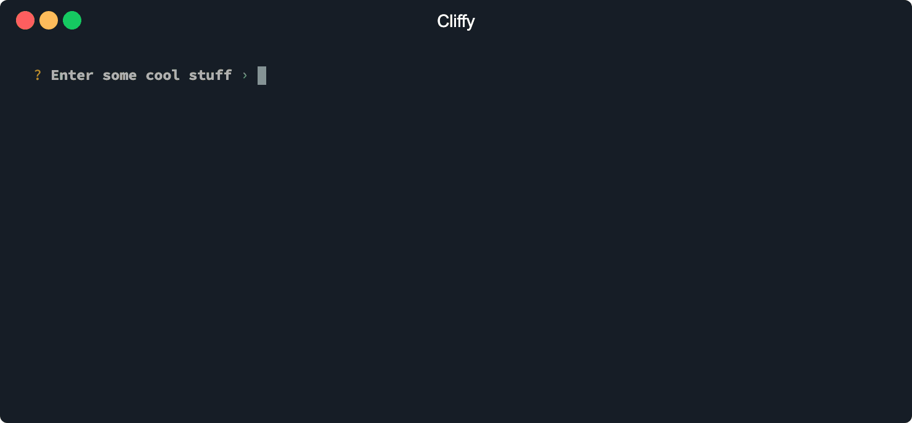
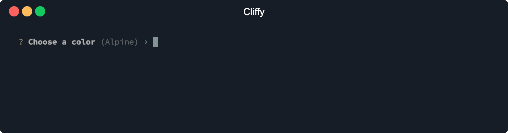
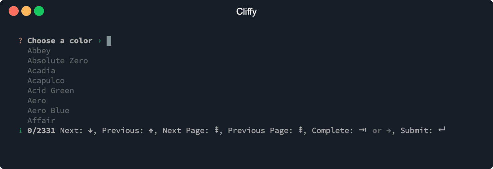
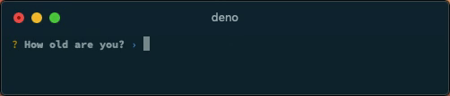
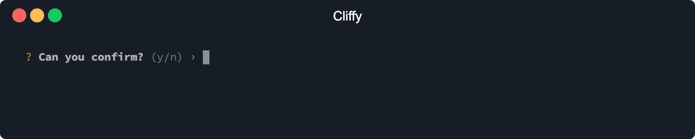
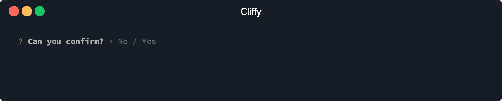
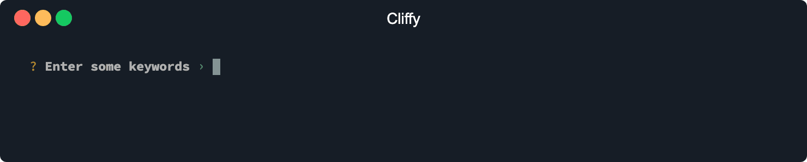
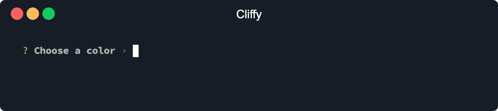
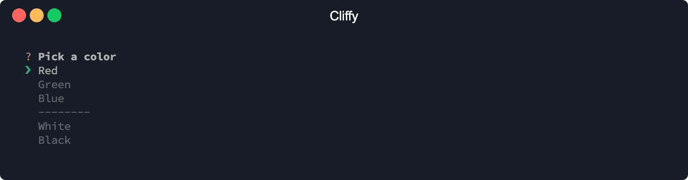

<h1 align="center">Cliffy ❯ Prompt</h1>

<p align="center" class="badges-container">
  <a href="https://github.com/c4spar/deno-cliffy/actions?query=workflow%3ATest">
    
  </a>
  <a href="https://github.com/c4spar/deno-cliffy/releases">
    
  </a>
  <a href="https://github.com/c4spar/deno-cliffy/labels/module%3Aprompt">
    
  </a>
  <a href="https://deno.land/">
    
  </a>
  <a href="https://doc.deno.land/https/deno.land/x/cliffy/prompt/mod.ts">
    
  </a>
  <a href="https://github.com/c4spar/deno-cliffy/actions?query=workflow%3Aci">
    
  </a>
  <a href="https://nest.land/package/cliffy">
    
  </a>
</p>

<p align="center">
  <b>Interactive prompt's for Deno with intelligent type interface </b></br>
</p>

<p align="center">
  
</p>

## ❯ Content

- [Install](#-install)
- [Usage](#-usage)
    - [Single Prompt](#single-prompt)
    - [Prompt List](#prompt-list)
    - [Dynamic Prompts](#dynamic-prompts)
    - [Custom Prompts](#custom-prompts)
    - [OS Signals](#os-signals)
- [API](#-api)
- [Types](#-types)
- [Contributing](#-contributing)
- [License](#-license)

## ❯ Install

This module can be imported directly from the repo and from following registries.

Deno Registry

```typescript
import { prompt } from "https://deno.land/x/cliffy@<version>/prompt/mod.ts";
```

Nest Registry

```typescript
import { prompt } from "https://x.nest.land/cliffy@<version>/prompt/mod.ts";
```

Github

```typescript
import { prompt } from "https://raw.githubusercontent.com/c4spar/deno-cliffy/<version>/prompt/mod.ts";
```

## ❯ Usage

### Single Prompt
Each prompt type is usable as standalone module and can be imported directly from the prompt specific module or from the main prompt module.
Each prompt has a static prompt method which accepts a prompt message or an options object and returns the prompt result.

Execute a single prompt with a single message.

```typescript
import { Input } from "https://deno.land/x/cliffy/prompt/mod.ts";

const name: string = await Input.prompt( `What's your name?` );
```

Execute a single prompt with an options object.

```typescript
import { Input } from "https://deno.land/x/cliffy/prompt/mod.ts";

const name: string = await Input.prompt( { message: `Choose a username`, minLength: 8 } );
```

### Prompt List

To execute a list of prompts you can use the `prompt()` method. The prompt method accapts an array of [prompt options](#-types) combined with a `name` and `type` property. **Make sure to give each prompt a unique name to prevent overwriting values!**

Unlike npm's inquerer, the `type` property accepts a prompt object and not the name of the prompt. This makes it possible to extract the options and return types of each prompt to get typed options for any prompt and a **typed result object**. This works also with [custom prompts](#custom-prompts) which are easily implemented. Another advantage is that you only import the modules that you really need.

```typescript
import { prompt, Input, Number, Confirm, Checkbox } from "https://deno.land/x/cliffy/prompt/mod.ts";

const result = await prompt([{
  name: "name",
  message: "What's your name?",
  type: Input,
}, {
  name: "age",
  message: "How old are you?",
  type: Number,
}, {
  name: "like",
  message: "Do you like animal's?",
  type: Confirm,
}, {
  name: "animals",
  message: "Select some animal's",
  type: Checkbox,
  options: ["dog", "cat", "snake"],
}]);

console.log(result);

// if ( result.foo ) {} // error: Property 'foo' does not exist
// if ( result.name && isNaN( result.name ) ) {} // error: Argument of type 'string' is not assignable to parameter of type 'number'.
// if ( result.age && isNaN( result.age ) ) {} // no error: age is of type number
```

```
$ deno run --unstable https://deno.land/x/cliffy/examples/prompt/prompt_list.ts
```

### Dynamic Prompts

You can dynamicly control the flow of the prompt list with the `before` and `after` callbacks which works like a middleware function. The first argument is the `result` object and the second argument a `next()` method. The next method calls the next prompt in the list if no argument is passed to it. To jump to a specific prompt pass the name or the index of the prompt to the next method. To skip the next prompt pass true to it. To skip all other prompts simple omit the next call.

```typescript
import { prompt, Number, Confirm, Checkbox } from "https://deno.land/x/cliffy/prompt/mod.ts";

const result = await prompt([{
  name: "animals",
  message: "Select some animal's",
  type: Checkbox,
  options: ["dog", "cat", "snake"],
}, {
  name: "like",
  message: "Do you like animal's?",
  type: Confirm,
  after: async ({ like }, next) => { // executed after like prompt
    if (like) {
      await next(); // run age prompt
    } else {
      await next("like"); // run like prompt again
    }
  },
}, {
  name: "age",
  message: "How old are you?",
  type: Number,
  before: async ({ animals }, next) => { // executed before age prompt
    if (animals?.length === 3) {
      await next(); // run age prompt
    } else {
      await next("animals"); // begin from start
    }
  },
}]);

console.log(result);
```

```
$ deno run --unstable https://deno.land/x/cliffy/examples/prompt/dynamic_prompts.ts
```

### Custom Prompts

A prompt is nothing more than an object with a prompt method. You can use a plain object or a class with a static prompt method.
The prompt method accepts an options object as argument and the return value will be stored in the results object.
Be shure to define an options and return type for your custom prompt method. Cliffy extracts the type of the options and return value to get **typed options** and a **typed result object** also for custom prompts.

```typescript
import { BufReader } from "https://deno.land/std/io/bufio.ts";
import { tty } from "https://deno.land/x/cliffy/ansi/mod.ts";
import { prompt, Input, Figures } from "https://deno.land/x/cliffy/prompt/mod.ts";

const result = await prompt([{
  name: "text",
  message: "Enter some text",
  // build-in prompt
  type: Input,
}, {
  name: "customText",
  message: "Enter more text",
  // using an object/method as custom prompt
  type: {
    async prompt(options: { message: string }): Promise<string> {
      const message = ` ? ${options.message} ${Figures.POINTER_SMALL} `;
      await Deno.stdout.write(new TextEncoder().encode(message));

      const result = await new BufReader(Deno.stdin).readLine();

      return result ? new TextDecoder().decode(result.line) : "";
    },
  },
}, {
  name: "customNumber",
  message: "Enter a number",
  // using a class as custom prompt
  type: class CustomPrompt {
    static async prompt(
      options: { message: string },
      error?: string,
    ): Promise<number> {
      const message = ` ? ${options.message} ${Figures.POINTER_SMALL} `;
      await Deno.stdout.write(new TextEncoder().encode(message));

      if (error) {
        tty.cursorSave();
        await Deno.stdout.write(new TextEncoder().encode("\n " + error));
        tty.cursorRestore();
      }

      const readLineResult = await new BufReader(Deno.stdin).readLine();
      const result: number = Number(
        readLineResult ? new TextDecoder().decode(readLineResult.line) : null,
      );

      if (isNaN(result)) {
        tty.cursorLeft.cursorUp.eraseDown();
        return this.prompt(options, `${result} is not a number.`);
      }

      return result;
    }
  },
}]);

console.log(result);

// if ( result.foo ) {} // error: Property 'foo' does not exist
// if ( result.customText && isNaN( result.customText ) ) {} // error: Argument of type 'string' is not assignable to parameter of type 'number'.
// if ( result.customNumber && isNaN( result.customNumber ) ) {} // no error: customNumber is of type number
```

```
$ deno run --unstable https://deno.land/x/cliffy/examples/prompt/custom_prompts.ts
```

### OS Signals

> The [cbreak](https://doc.deno.land/builtin/unstable#Deno.setRaw) option is an unstable feature and requires Deno => 1.6 and works currently only on Linux and macOS!

By default, cliffy will call `Deno.exit(0)` after the user presses `ctrl+c`. If you need to use a custom signal
handler, you can enable the `cbreak` option on your prompt. This will enable pass-through of os signals to deno,
allowing you to register your own signal handler. Currently, when using prompts like `Select` or `Toggle` and `cbreak`
mode is enabled, you must manually show the cursor before calling `Deno.exit()`. Maybe this will be improved somehow
in the future.

```typescript
import { tty } from "https://deno.land/x/cliffy/ansi/tty.ts";
import { Toggle } from "https://deno.land/x/cliffy/prompt/toggle.ts";

const sig = Deno.signals.interrupt();
(async () => {
  for await (const _ of sig) {
    tty.cursorShow();
    console.log("\nSigint received. Exiting deno process!");
    Deno.exit(1);
  }
})();

const confirmed: boolean = await Toggle.prompt({
  message: "Please confirm",
  cbreak: true,
});

console.log({ confirmed });

sig.dispose();
```

```
$ deno run --unstable https://deno.land/x/cliffy/examples/prompt/os_signals.ts
```

## ❯ API

### prompt(prompts, options)

Execute a list of prompts.

An prompt object has following options and all type specific options. See the list of [prompt types](#-types) for all available options.

| Param | Type | Required | Description |
| ----- | :---: | :---: | ----------- |
| name | `string` | Yes | The response will be saved under this key/property in the returned response object. |
| type | `string` | Yes | Defines the type of prompt to display. See the list of [prompt types](#-types) for valid values. |
| before | `(result, next) => Promise<void>` | No | `next()`execute's the next prompt in the list (for the before callback it's the current prompt). To change the index to a specific prompt you can pass the name or index of the prompt to the `next()` method. To skip this prompt you can pass `true` to the `next()` method. If `next()` isn't called all other prompts will be skipped. |
| after | `(result, next) => Promise<void>` | No | Same as `before` but will be executed *after* the prompt. |

The prompt method has also following global options.

| Param | Type | Required | Description |
| ----- | :---: | :---: | ----------- |
| before | `(result, next) => Promise<void>` | No | Same as above but will be executed before each prompt. |
| after | `(result, next) => Promise<void>` | No | Same as above but will be executed after each prompt. |
| cbreak | `boolean` | No | cbreak mode enables pass-through of os signals to deno, allowing you to register your own signal handler (see [OS Signals](#os-signals)). **This is an unstable feature and requires Deno => 1.6!** |

### Prompt.prompt(options)

For all available options see [prompt types](#-types).

## ❯ Types

* [input](#%EF%B8%8F-input)
* [number](#-number)
* [secret](#-secret)
* [confirm](#-confirm)
* [toggle](#-toggle)
* [list](#-list)
* [select](#-select)
* [checkbox](#%EF%B8%8F-checkbox)

#### Base Options

All prompts have the following base options:

| Param | Type | Required | Description |
| ----- | :---: | :---: | ----------- |
| message | `string` | Yes | Prompt message to display. |
| default | `T` | No | Default value. Type depends on prompt type. |
| transform | `(value: V) => T \| undefined` | No | Receive user input. The returned value will be returned by the `.prompt()` method. |
| validate | `(value: T \| undefined) => ValidateResult` | No | Receive sanitized user input. Should return `true` if the value is valid, and an error message `String` otherwise. If `false` is returned, a default error message is shown |
| hint | `string` | No | Hint to display to the user. |
| pointer | `string` | No | Change the pointer icon. |
| indent | `string` | No | Prompt indentation. Defaults to `' '` |
| cbreak | `boolean` | No | cbreak mode enables pass-through of os signals to deno, allowing you to register your own signal handler (see [OS Signals](#os-signals)). **This is an unstable feature and requires Deno => 1.6!** |

***

### ✏️ Input

**Example**


```typescript
import { Input } from "https://deno.land/x/cliffy/prompt/input.ts";

const name: string = await Input.prompt("What's your github user name?");
```

```
$ deno run --unstable https://deno.land/x/cliffy/examples/prompt/input.ts
```

#### Auto suggestions

You can add suggestions to the `Input`, `Number` and `List` prompt to enable tab-completions.



```typescript
import { Input } from "https://deno.land/x/cliffy/prompt/input.ts";

const color: string = await Input.prompt({
  message: "Choose a color",
  suggestions: [
    "Abbey",
    "Absolute Zero",
    "Acadia",
    "Acapulco",
    "Acid Green",
    "Aero",
    "Aero Blue",
    "Affair",
    "African Violet",
    "Air Force Blue",
  ],
});

console.log({ color });
```

```
$ deno run --unstable https://deno.land/x/cliffy/examples/prompt/suggestions.ts
```

Suggestions can be also shown as a list. Matched suggestions will be highlighted in the list and can be completed
with the `tab` key.

You can also enable the info bar to show the number of available suggestions and usage information. 



```typescript
import { Input } from "https://deno.land/x/cliffy/prompt/input.ts";

const color: string = await Input.prompt({
  message: "Choose a color",
  list: true,
  info: true,
  suggestions: [
    "Abbey",
    "Absolute Zero",
    "Acadia",
    "Acapulco",
    "Acid Green",
    "Aero",
    "Aero Blue",
    "Affair",
    "African Violet",
    "Air Force Blue",
  ],
});

console.log({ color });
```

```
$ deno run --unstable https://deno.land/x/cliffy/examples/prompt/suggestions_list.ts
```

**Options**

The `Input` prompt has all [base](#base-options) and the following prompt specific options.

| Param | Type | Required | Description |
| ----- | :---: | :---: | ----------- |
| minLength | `number` | No | Min length of value. Defaults to `0`. |
| maxLength | `number` | No | Max length of value. Defaults to `infinity`. |
| suggestions | `Array<string \| number>` | No | A list of auto suggestions. |
| list | `number` | No | Show auto suggestions list. |
| maxRows | `number` | No | Number of options suggestions per page. Defaults to `10`. |
| listPointer | `string` | No | Change the list pointer icon. |
| info | `number` | No | Show some usage information. |

**↑ back to:** [Prompt types](#-types)

***

### 💯 Number

**Example**



```typescript
import { Number } from "https://deno.land/x/cliffy/prompt/number.ts";

const age: number = await Number.prompt("How old are you?");
```

```
$ deno run --unstable https://deno.land/x/cliffy/examples/prompt/number.ts
```

**Options**

The `Number` prompt has all [base options](#base-options) and the following prompt specific options.

| Param | Type | Required | Description |
| ----- | :---: | :---: | ----------- |
| min | `number` | No | Min value. Defaults to `-infinity`. |
| max | `number` | No | Max value. Defaults to `Infinity`. |
| float | `boolean` | No | Allow floating point inputs. Defaults to `false`. |
| round | `number` | No | Round float values to `x` decimals. Defaults to `2`. |
| suggestions | `Array<string \| number>` | No | A list of auto suggestions. |
| list | `number` | No | Show auto suggestions list. |
| maxRows | `number` | No | Number of options suggestions per page. Defaults to `10`. |
| listPointer | `string` | No | Change the list pointer icon. |
| info | `number` | No | Show some usage information. |

**↑ back to:** [Prompt types](#-types)

***

### 🔑 Secret

**Example**


```typescript
import { Secret } from "https://deno.land/x/cliffy/prompt/secret.ts";

const password: string = await Secret.prompt("Enter your password");
```

```
$ deno run --unstable https://deno.land/x/cliffy/examples/prompt/secret.ts
```

**Options**

The `Secret` prompt has all [base options](#base-options) and the following prompt specific options.

| Param | Type | Required | Description |
| ----- | :---: | :---: | ----------- |
| label | `string` | No | Name of secret. Defaults to `Password`. |
| hidden | `number` | No | Hide input during typing and show a fix number of asterisk's on success. |
| minLength | `number` | No | Min length of secret value. Defaults to `0`. |
| maxLength | `number` | No | Max length of secret value. Defaults to `infinity`. |

**↑ back to:** [Prompt types](#-types)

***

### 👌 Confirm

**Example**



```typescript
import { Confirm } from "https://deno.land/x/cliffy/prompt/confirm.ts";

const confirmed: boolean = await Confirm.prompt("Can you confirm?");
```

```
$ deno run --unstable https://deno.land/x/cliffy/examples/prompt/confirm.ts
```

**Options**

The `Config` prompt has all [base options](#base-options) and the following prompt specific options.

| Param | Type | Required | Description |
| ----- | :---: | :---: | ----------- |
| active | `string` | No | Text for `active` state. Defaults to `'Yes'`. |
| inactive | `string` | No | Text for `inactive` state. Defaults to `'No'`. |

**↑ back to:** [Prompt types](#-types)

***

### 🔘 Toggle

**Example**



```typescript
import { Toggle } from "https://deno.land/x/cliffy/prompt/toggle.ts";

const confirmed: boolean = await Toggle.prompt("Can you confirm?");
```

```
$ deno run --unstable https://deno.land/x/cliffy/examples/prompt/toggle.ts
```

**Options**

The `Toggle` prompt has all [base options](#base-options) and the following prompt specific options.

| Param | Type | Required | Description |
| ----- | :---: | :---: | ----------- |
| active | `string` | No | Text for `active` state. Defaults to `'Yes'`. |
| inactive | `string` | No | Text for `inactive` state. Defaults to `'No'`. |

**↑ back to:** [Prompt types](#-types)

***

### 📃 List

**Example**



```typescript
import { List } from "https://deno.land/x/cliffy/prompt/list.ts";

const keywords: string[] = await List.prompt("Enter some keywords");
```

```
$ deno run --unstable https://deno.land/x/cliffy/examples/prompt/list.ts
```

#### Auto suggestions

You can add suggestions to the `Input`, `Number` and `List` prompt to enable tab-completions.



```typescript
import { List } from "https://deno.land/x/cliffy/prompt/list.ts";

const color: string = await List.prompt({
  message: "Choose a color",
  suggestions: [
    "Abbey",
    "Absolute Zero",
    "Acadia",
    "Acapulco",
    "Acid Green",
    "Aero",
    "Aero Blue",
    "Affair",
    "African Violet",
    "Air Force Blue",
  ],
});

console.log({ color });
```

```
$ deno run --unstable https://deno.land/x/cliffy/examples/prompt/suggestions_list_prompt.ts
```

**Options**

The `List` prompt has all [base options](#base-options) and the following prompt specific options.

| Param | Type | Required | Description |
| ----- | :---: | :---: | ----------- |
| separator | `string` | No | String separator. Will trim all white-spaces from start and end of string. Defaults to `','`. |
| minLength | `number` | No | Min length of a single tag. Defaults to `0`. |
| maxLength | `number` | No | Max length of a single tag. Defaults to `infinity`. |
| minTags | `number` | No | Min number of tags. Defaults to `0`. |
| maxTags | `number` | No | Max number of tags. Defaults to `infinity`. |
| suggestions | `Array<string \| number>` | No | A list of auto suggestions. |
| list | `number` | No | Show auto suggestions list. |
| maxRows | `number` | No | Number of options suggestions per page. Defaults to `10`. |
| listPointer | `string` | No | Change the list pointer icon. |
| info | `number` | No | Show some usage information. |

**↑ back to:** [Prompt types](#-types)

***

### ❯ Select

**Example**



```typescript
import { Select } from "https://deno.land/x/cliffy/prompt/select.ts";

const color: string = await Select.prompt({
  message: "Pick a color",
  options: [
    { name: "Red", value: "#ff0000" },
    { name: "Green", value: "#00ff00", disabled: true },
    { name: "Blue", value: "#0000ff" },
    Select.separator("--------"),
    { name: "White", value: "#ffffff" },
    { name: "Black", value: "#000000" },
  ],
});
```

```
$ deno run --unstable https://deno.land/x/cliffy/examples/prompt/select.ts
```

**Options**

The `Select` prompt has all [base options](#base-options) and the following prompt specific options.

| Param | Type | Required | Description |
| ----- | :---: | :---: | ----------- |
| options | `(string \| Option)[]` | Yes | Array of string's or Option's. |
| maxRows | `number` | No | Number of options displayed per page. Defaults to `10`. |
| listPointer | `string` | No | Change the list pointer icon. |
| search | `boolean` | No | Enable search/filter input. |
| searchLabel | `string` | No | Change the search input label. |

**Option**

| Param | Type | Required | Description |
| ----- | :---: | :---: | ----------- |
| value | `string` | Yes | Value which will be returned as result. |
| name | `string` | No | Name is displayed in the list. Defaults to `value` |
| disabled | `boolean` | No | Disabled item. Can't be selected. |

**↑ back to:** [Prompt types](#-types)

***

### ✔️ Checkbox

**Example**


```typescript
import { Checkbox } from "https://deno.land/x/cliffy/prompt/checkbox.ts";

const colors: string[] = await Checkbox.prompt({
  message: "Pick a color",
  options: [
    { name: "Red", value: "#ff0000" },
    { name: "Green", value: "#00ff00", disabled: true },
    { name: "Blue", value: "#0000ff" },
    Checkbox.separator("--------"),
    { name: "White", value: "#ffffff" },
    { name: "Black", value: "#000000" },
  ],
});
```

```
$ deno run --unstable https://deno.land/x/cliffy/examples/prompt/checkbox.ts
```

**Options**

The `Checkbox` prompt has all [base options](#base-options) and the following prompt specific options.

| Param | Type | Required | Description |
| ----- | :---: | :---: | ----------- |
| options | `(string \| Option)[]` | Yes | Array of string's or Option's. |
| maxRows | `number` | No | Number of options displayed per page. Defaults to `10`. |
| minOptions | `number` | No | Min number of selectable options. Defaults to `0`. |
| maxOptions | `number` | No | Max number of selectable options. Defaults to `infinity`. |
| listPointer | `string` | No | Change the list pointer icon. |
| search | `boolean` | No | Enable search/filter input. |
| searchLabel | `string` | No | Change the search input label. |
| check | `string` | No | Change the check icon. |
| uncheck | `string` | No | Change the uncheck icon. |

**Option**

| Param | Type | Required | Description |
| ----- | :---: | :---: | ----------- |
| value | `string` | Yes | Value which will be added to the returned result array. |
| name | `string` | No | Name is displayed in the list. Defaults to `value`. |
| disabled | `boolean` | No | Disabled item. Can't be selected. |
| checked | `boolean` | No | Whether item is checked or not. Defaults to `false`. |
| icon | `boolean` | No | Show or hide item icon. Defaults to `true`. |

**↑ back to:** [Prompt types](#-types)

## ❯ Contributing

Any kind of contribution is welcome! Please take a look at the [contributing guidelines](../CONTRIBUTING.md).

## ❯ License

[MIT](../LICENSE)
