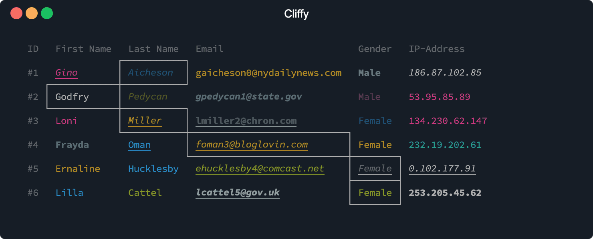
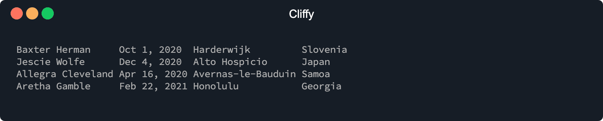
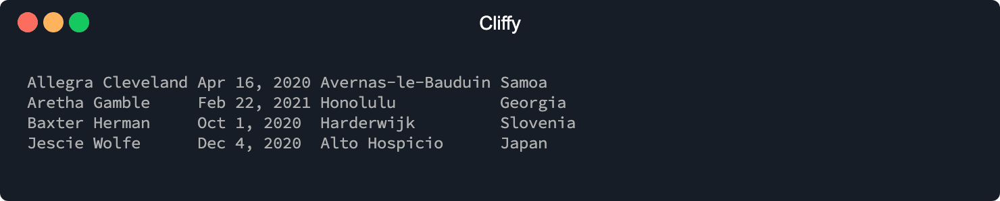
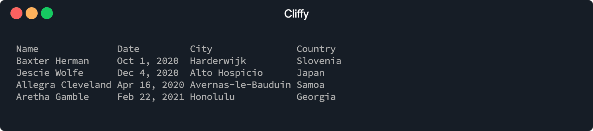
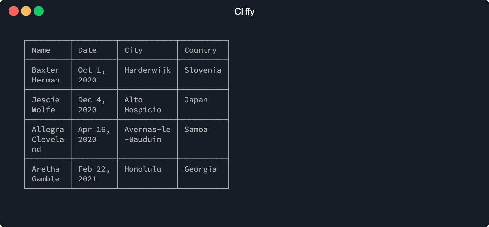
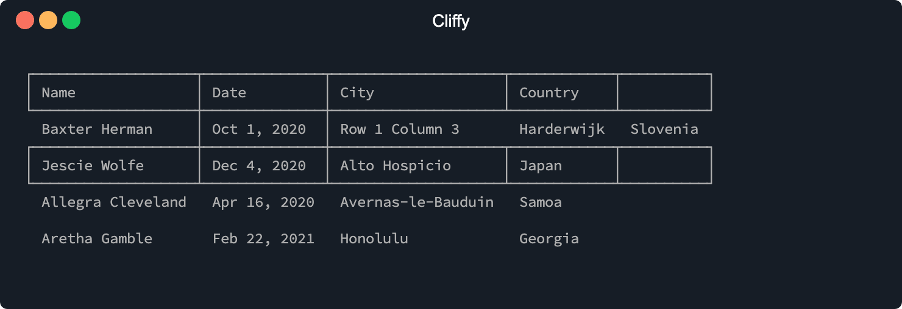
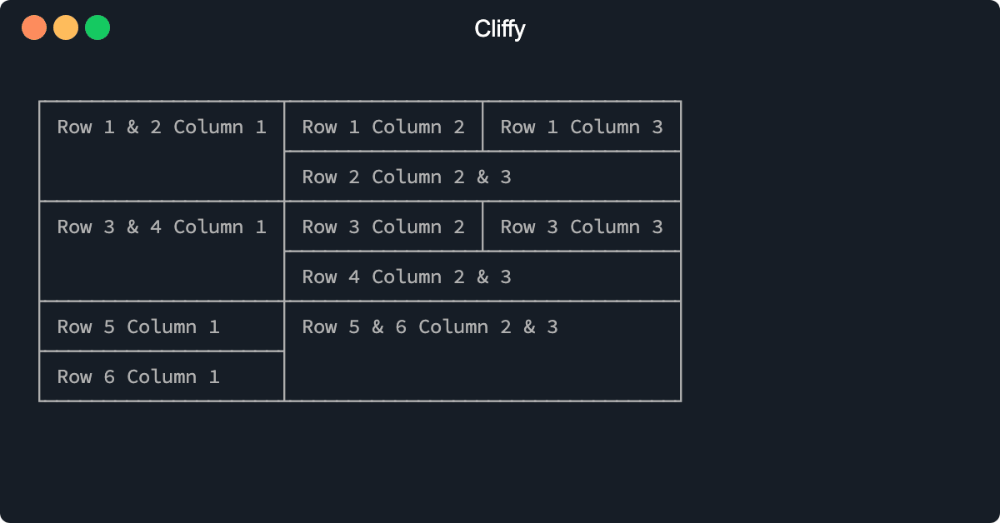

<h1 align="center">Cliffy ❯ Table </h1>

<p align="center" class="badges-container">
  <a href="https://github.com/c4spar/deno-cliffy/releases">
    
  </a>
  <a href="https://github.com/c4spar/deno-cliffy/actions/workflows/test.yml">
    
  </a>
  <a href="https://codecov.io/gh/c4spar/deno-cliffy">
    
  </a>
  <a href="https://github.com/c4spar/deno-cliffy/labels/module%3Atable">
    
  </a>
  <a href="https://deno.land/">
    
  </a>
  <a href="https://doc.deno.land/https/deno.land/x/cliffy/table/mod.ts">
    
  </a>
  <a href="https://discord.gg/ghFYyP53jb">
    
  </a>
  <a href="../LICENSE">
    
  </a>
  <br>
  <a href="https://deno.land/x/cliffy">
    
  </a>
  <a href="https://nest.land/package/cliffy">
    
  </a>
</p>

<p align="center">
  <b>Fast and customizable table module to render unicode table's on the command line</b>
</p>

<p align="center">
  
</p>

## ❯ Content

- [Install](#-install)
- [Usage](#-usage)
  - [Basic Usage](#basic-usage)
  - [Using as Array](#using-as-array)
  - [Header and Body](#header-and-body)
  - [Table Options](#table-options)
  - [Row's and Cell's](#rows-and-cells)
  - [Colspan and Rowspan](#colspan-and-rowspan)
- [API](#-api)
- [Contributing](#-contributing)
- [License](#-license)

## ❯ Install

This module can be imported directly from the repo and from following
registries.

Deno Registry

```typescript
import { Table } from "https://deno.land/x/cliffy@<version>/table/mod.ts";
```

Nest Registry

```typescript
import { Table } from "https://x.nest.land/cliffy@<version>/table/mod.ts";
```

Github

```typescript
import { Table } from "https://raw.githubusercontent.com/c4spar/deno-cliffy/<version>/table/mod.ts";
```

## ❯ Usage

### Basic Usage

To create a table you can simple create an instance of the `Table` class and
pass the rows as arguments to the constructor. The example below will output a
simple table with three rows and without any styles. The only default option is
`padding` which is set to `1`.

```typescript
const table: Table = new Table(
  ["Baxter Herman", "Oct 1, 2020", "Harderwijk", "Slovenia"],
  ["Jescie Wolfe", "Dec 4, 2020", "Alto Hospicio", "Japan"],
  ["Allegra Cleveland", "Apr 16, 2020", "Avernas-le-Bauduin", "Samoa"],
  ["Aretha Gamble", "Feb 22, 2021", "Honolulu", "Georgia"],
);

console.log(table.toString());
```

```console
$ deno run https://deno.land/x/cliffy/examples/table/basic_usage.ts
```



### Using as Array

Since the `Table` class is an `Array`, you can call all the methods of the array
class like `.from()`, `.sort()`, `.push()`, `.unshift()` and friends.

```typescript
const table: Table = Table.from([
  ["Baxter Herman", "Oct 1, 2020", "Harderwijk", "Slovenia"],
  ["Jescie Wolfe", "Dec 4, 2020", "Alto Hospicio", "Japan"],
  ["Allegra Cleveland", "Apr 16, 2020", "Avernas-le-Bauduin", "Samoa"],
]);

table.push(["Aretha Gamble", "Feb 22, 2021", "Honolulu", "Georgia"]);
table.sort();
table.render();
```

```console
$ deno run https://deno.land/x/cliffy/examples/table/using_as_array.ts
```



### Header and Body

To define a table header you can use the `.header()` method. The header is not
affected by any `Array` method like `.sort()` because it is stored as a separate
property and not in the array stack. The `.body()` method adds an array of rows
to the table and removes all existing rows.

```typescript
new Table()
  .header(["Name", "Date", "City", "Country"])
  .body([
    ["Baxter Herman", "Oct 1, 2020", "Harderwijk", "Slovenia"],
    ["Jescie Wolfe", "Dec 4, 2020", "Alto Hospicio", "Japan"],
    ["Allegra Cleveland", "Apr 16, 2020", "Avernas-le-Bauduin", "Samoa"],
    ["Aretha Gamble", "Feb 22, 2021", "Honolulu", "Georgia"],
  ])
  .render();
```

```console
$ deno run https://deno.land/x/cliffy/examples/table/header_and_body.ts
```



### Table Options

To customize the table, the table class provides a few chainable option methods.
To see a list of all available options go to the [Talbe](#table) API section.

```typescript
new Table()
  .header(["Name", "Date", "City", "Country"])
  .body([
    ["Baxter Herman", "Oct 1, 2020", "Harderwijk", "Slovenia"],
    ["Jescie Wolfe", "Dec 4, 2020", "Alto Hospicio", "Japan"],
    ["Allegra Cleveland", "Apr 16, 2020", "Avernas-le-Bauduin", "Samoa"],
    ["Aretha Gamble", "Feb 22, 2021", "Honolulu", "Georgia"],
  ])
  .maxColWidth(10)
  .padding(1)
  .indent(2)
  .border(true)
  .render();
```

```console
$ deno run https://deno.land/x/cliffy/examples/table/table_options.ts
```



### Row's and Cell's

It is also possible to customize single rows and cell. To do this you can use
the `Row` and `Cell` class. The `Row` class is also an `Array` class like the
`Table` class. To see a list of all available options go to the [Row](#row) or
[Cell](#cell) API section.

```typescript
import {
  Cell,
  Row,
  Table,
} from "https://deno.land/x/cliffy@<version>/table/mod.ts";

new Table()
  .header(Row.from(["Name", "Date", "City", "Country"]).border(true))
  .body([
    [
      "Baxter Herman",
      Cell.from("Oct 1, 2020").border(true),
      "Row 1 Column 3",
      "Harderwijk",
      "Slovenia",
    ],
    new Row("Jescie Wolfe", "Dec 4, 2020", "Alto Hospicio", "Japan").border(
      true,
    ),
    ["Allegra Cleveland", "Apr 16, 2020", "Avernas-le-Bauduin", "Samoa"],
    ["Aretha Gamble", "Feb 22, 2021", "Honolulu", "Georgia"],
  ])
  .render();
```

```console
$ deno run https://deno.land/x/cliffy/examples/table/rows_and_cells.ts
```



### Colspan and Rowspan

Colspan and rowspan allows a single table cell to span the width/height of more
than one column and/or row.

```typescript
Table.from([
  [
    Cell.from("Row 1 & 2 Column 1").rowSpan(2),
    "Row 1 Column 2",
    "Row 1 Column 3",
  ],
  [Cell.from("Row 2 Column 2 & 3").colSpan(2)],
  [
    Cell.from("Row 3 & 4 Column 1").rowSpan(2),
    "Row 3 Column 2",
    "Row 3 Column 3",
  ],
  [Cell.from("Row 4 Column 2 & 3").colSpan(2)],
  ["Row 5 Column 1", Cell.from("Row 5 & 6 Column 2 & 3").rowSpan(2).colSpan(2)],
  ["Row 6 Column 1"],
])
  .border(true)
  .render();
```

```console
$ deno run https://deno.land/x/cliffy/examples/table/colspan_and_rowspan.ts
```



## ❯ API

- [Table](#table)
  - [.header(row)](#headerrow)
  - [.body(rows)](#bodyrows)
  - [.clone()](#clone)
  - [.toString()](#tostring)
  - [.render()](#render)
  - [.minColWidth(width,override)](#mincolwidthwidthoverride)
  - [.maxColWidth(width,override)](#maxcolwidthwidthoverride)
  - [.indent(width,override)](#indentwidthoverride)
  - [.padding(padding,override)](#paddingpaddingoverride)
  - [.border(enable,override)](#borderenableoverride)
  - [.align(direction,override)](#borderdirectionoverride)
  - [.chars(chars)](#charschars)
  - [.getHeader()](#getheader)
  - [.getBody()](#getbody)
  - [.getMinColWidth()](#getmincolwidth)
  - [.getMaxColWidth()](#getmaxcolwidth)
  - [.getIndent()](#getindent)
  - [.getPadding()](#getpadding)
  - [.getBorder()](#getborder)
  - [.getAlign()](#getalign)
- [Row](#row)
  - [.clone()](#clone-1)
  - [.border(enable,override)](#borderenableoverride-1)
  - [.align(direction,override)](#borderdirectionoverride-1)
  - [.getBorder()](#getborder-1)
  - [.getAlign()](#getalign-1)
- [Cell](#cell)
  - [.clone()](#clone-2)
  - [.border(enable,override)](#borderenableoverride-2)`
  - [.align(direction,override)](#borderdirectionoverride-2)
  - [.colSpan(span,override)](#colspanspanoverride)
  - [.rowSpan(span,override)](#rowspanspanoverride)
  - [.getBorder()](#getborder-2)
  - [.getAlign()](#getalign-2)
  - [.getColSpan()](#getcolspan)
  - [.getRowSpan()](#getrowspan)

### Table

#### .header(row)

Sets the table header row.

| Argument |  Type  | Required | Description                                  |
| -------- | :----: | :------: | -------------------------------------------- |
| row      | `IRow` |   Yes    | Can be an `Array` of `string`'s and `Cell`'s |

_Return type_: `this`

#### .body(rows)

Adds an array of rows to the table and removes all existing rows.

| Argument |     Type      | Required | Description                                                          |
| -------- | :-----------: | :------: | -------------------------------------------------------------------- |
| rows     | `Array<IRow>` |   Yes    | `Array` of row's. A row can be an `Array` of `string`'s and `Cell`'s |

_Return type_: `this`

#### .clone()

Clones the table.

_Return type_: `this`

#### .toString()

Generates the table string.

_Return type_: `string`

#### .render()

Outputs the result of the `.toString()` method with `Deno.stdout.writeSnyc()`.

_Return type_: `this`

#### .minColWidth(width,override)

Set min column with.

| Argument |   Type    |    Required    | Description                                                    |
| -------- | :-------: | :------------: | -------------------------------------------------------------- |
| width    |  `number  | Array<number>` | Yes                                                            |
| override | `boolean` |       No       | Set override to `false` to prevent overriding existing values. |

_Return type_: `this`

#### .maxColWidth(width,override)

Set max column with.

| Argument |   Type    |    Required    | Description                                                    |
| -------- | :-------: | :------------: | -------------------------------------------------------------- |
| width    |  `number  | Array<number>` | Yes                                                            |
| override | `boolean` |       No       | Set override to `false` to prevent overriding existing values. |

_Return type_: `this`

#### .indent(width,override)

Indent the table output.

| Argument |   Type    | Required | Description                                                    |
| -------- | :-------: | :------: | -------------------------------------------------------------- |
| width    | `number`  |   Yes    | Indent width.                                                  |
| override | `boolean` |    No    | Set override to `false` to prevent overriding existing values. |

_Return type_: `this`

#### .padding(padding,override)

Set column padding. If border is enabled the padding will be applyed on the left
and the right side of each cell.

| Argument |   Type    | Required  | Description                                                    |
| -------- | :-------: | :-------: | -------------------------------------------------------------- |
| padding  |  `number  | number[]` | Yes                                                            |
| override | `boolean` |    No     | Set override to `false` to prevent overriding existing values. |

_Return type_: `this`

#### .border(enable,override)

Enable table border. Doesn't override row and cell settings.

| Argument |   Type    | Required | Description                                                    |
| -------- | :-------: | :------: | -------------------------------------------------------------- |
| enable   | `boolean` |   Yes    | Enable or disable table border.                                |
| override | `boolean` |    No    | Set override to `false` to prevent overriding existing values. |

_Return type_: `this`

#### .align(direction,override)

Align table content.

| Argument  |               Type                | Required | Description                                                    |
| --------- | :-------------------------------: | :------: | -------------------------------------------------------------- |
| direction | `"left"`, `"center"` or `"right"` |   Yes    | Set alignment direction.                                       |
| override  |             `boolean`             |    No    | Set override to `false` to prevent overriding existing values. |

_Return type_: `this`

#### .chars(chars)

Override default border characters. Doesn't override row and cell settings. To
change the default border characters globally you can use the static
`Table.chars(chars)` method.

| Argument |       Type       | Required | Description                                                    |
| -------- | :--------------: | :------: | -------------------------------------------------------------- |
| chars    | `IBorderOptions` |   Yes    | An object with border characters.                              |
| override |    `boolean`     |    No    | Set override to `false` to prevent overriding existing values. |

Here is an example of the default border characters:

```console
{
  top: "─",
  topMid: "┬",
  topLeft: "┌",
  topRight: "┐",
  bottom: "─",
  bottomMid: "┴",
  bottomLeft: "└",
  bottomRight: "┘",
  left: "│",
  leftMid: "├",
  mid: "─",
  midMid: "┼",
  right: "│",
  rightMid: "┤",
  middle: "│",
}
```

_Return type_: `this`

#### .getHeader()

Returns the header row.

_Return type_: `Row | undefined`

#### .getBody()

Returns all body rows.

_Return type_: `IRow[]`

#### .getMinColWidth()

Get min columns width.

_Return type_: `number | number[]`

#### .getMaxColWidth()

Get max columns width.

_Return type_: `number | number[]`

#### .getIndent()

Get indent width.

_Return type_: `number`

#### .getPadding()

Get padding.

_Return type_: `number | number[]`

#### .getBorder()

Check if border is enabled on the table.

_Return type_: `boolean`

#### .getAlign()

Get table alignment.

_Return type_: `"left"`, `"center"` or `"right"`

---

### Row

#### .clone()

Clones the row.

_Return type_: `this`

#### .border(enable,override)

Enable row border. Override table settings but not cell settings.

| Argument |   Type    | Required | Description                                                    |
| -------- | :-------: | :------: | -------------------------------------------------------------- |
| enable   | `boolean` |   Yes    | Enable or disable table border.                                |
| override | `boolean` |    No    | Set override to `false` to prevent overriding existing values. |

_Return type_: `this`

#### .align(direction,override)

Align row content.

| Argument  |               Type                | Required | Description                                                    |
| --------- | :-------------------------------: | :------: | -------------------------------------------------------------- |
| direction | `"left"`, `"center"` or `"right"` |   Yes    | Set alignment direction.                                       |
| override  |             `boolean`             |    No    | Set override to `false` to prevent overriding existing values. |

_Return type_: `this`

#### .getBorder()

Check if border is enabled on the row.

_Return type_: `boolean`

#### .getAlign()

Get row alignment.

_Return type_: `"left"`, `"center"` or `"right"`

---

### Cell

#### .clone()

Clones the cell.

_Return type_: `this`

#### .border(enable,override)

Enable cell border. Overrides table and row settings.

| Argument |   Type    | Required | Description                                                    |
| -------- | :-------: | :------: | -------------------------------------------------------------- |
| enable   | `boolean` |   Yes    | Enable or disable table border.                                |
| override | `boolean` |    No    | Set override to `false` to prevent overriding existing values. |

_Return type_: `this`

#### .align(direction,override)

Align cell content.

| Argument  |               Type                | Required | Description                                                    |
| --------- | :-------------------------------: | :------: | -------------------------------------------------------------- |
| direction | `"left"`, `"center"` or `"right"` |   Yes    | Set alignment direction.                                       |
| override  |             `boolean`             |    No    | Set override to `false` to prevent overriding existing values. |

_Return type_: `this`

#### .colSpan(span,override)

Allows a single table cell to span the width of more than one cell or column.
Can be combined with `.rowSpan()`.

| Argument |   Type    | Required | Description                                                    |
| -------- | :-------: | :------: | -------------------------------------------------------------- |
| span     | `number`  |   Yes    | Number of columns to span the cell.                            |
| override | `boolean` |    No    | Set override to `false` to prevent overriding existing values. |

_Return type_: `this`

#### .rowSpan(span,override)

Allows a single table cell to span the height of more than one cell or row. Can
be combined with `.colSpan()`.

| Argument |   Type    | Required | Description                                                    |
| -------- | :-------: | :------: | -------------------------------------------------------------- |
| span     | `number`  |   Yes    | Number of rows to span the cell.                               |
| override | `boolean` |    No    | Set override to `false` to prevent overriding existing values. |

_Return type_: `this`

#### .getBorder()

Check if border is enabled on the cell.

_Return type_: `boolean`

#### .getAlign()

Get cell alignment.

_Return type_: `"left"`, `"center"` or `"right"`

#### .getColSpan()

Get cell column span.

_Return type_: `number`

#### .getRowSpan()

Get cell row span.

_Return type_: `number`

## ❯ Contributing

Any kind of contribution is welcome! Please take a look at the
[contributing guidelines](../CONTRIBUTING.md).

## ❯ License

[MIT](../LICENSE)
